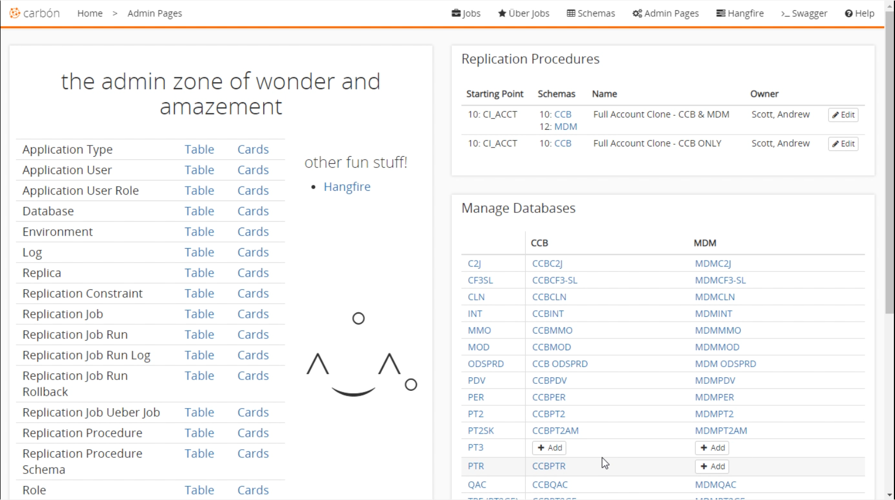
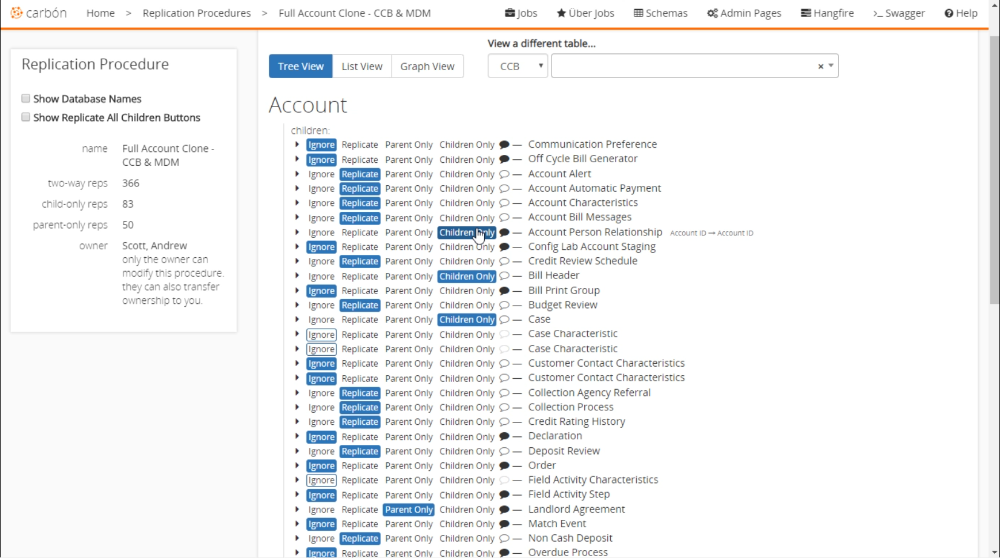

# Admin Pages
The admin pages are used to view and configure the supporting data for Carbon. Here you can configure environments as well as add databases, teams, users, and much more.

## Overview

### Options
The main section on the left is a list of the options you can configure in Carbon. It consists of a 'Table' and 'Cards' column. 'Table' is used to configure Carbon for use on a desktop, and 'Cards' are used to configure Carbon for use on a mobile device.

### Replication Procedures
This section shows a list of already defined replication procedures. By clicking the `edit` button it allows you to [configure a replication procedure](#Configure-Replication-Procedure).

---
### Manage Databases
Inside the manage database section, you can add or edit CCB and MDM databases for each environment that is created.

---
## Configure Replication Procedure
In this section, you can change the relationships between the source account and the replicated account. For each of the items in the account you can choose: Ignore, Replicate, Parent Only, or Children Only. 'Parent Only' will only replicate this data if the replication is going from a child account to a parent. 'Child Only' is when the replication goes from a parent account to a child account.
For each of the items here, you can expand to see that specific item's children and configure their replication properties. You can also leave notes on specific items if desired. 

---
## Hangfire
Hangfire is used to run the underlying Carbon jobs, Queueing, etc. If you have an issue with queues, you can check it from here. It is accessed from the `Hangfire` link on the admin page.
