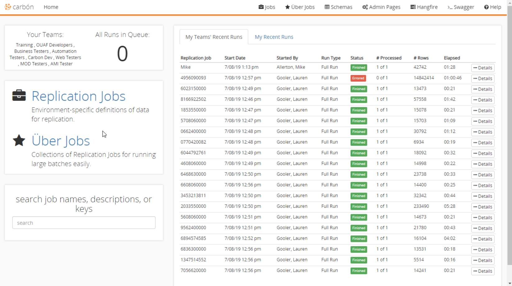

# Application Home Overview
The application home screen is divided into several main sections: Header, Teams, Jobs, Search, and Recent Runs.

## Header
The header is used to show the current screen you are on as well as access some of the features and options in Carbon. You can navigate to your jobs, [Uber Jobs](Uber-Jobs.md), [Schema Explorer](Schema-Explorer.md), [Admin Pages](Admin-Pages.md), and [Hangfire](Admin-Pages.md#hangfire). There is also a Swagger generated webpage showing the complete API of Carbon with additional documentation. 

## Teams
Teams are used to segregate the accounts within the application. You cannot see accounts in a team if you are not part of that team. 
The number of runs in the queue is displayed in this section. It provides an easy way to see how many jobs need to be completed before a new one can start.

## Jobs
The jobs section allows you to navigate to 'Replication' or 'Uber Jobs'. Click [here](TODO) to learn more about jobs. 

## Search
In the lower left-hand corner of the screen, the 'Search' section allows you to search for accounts using account numbers, job names, descriptions, or keys, etc. It is an easy way to find a specific account and access it quickly.

## Recent Runs
This is the section that makes up the right-hand side of the screen. It displays all the recent runs your team has made. There is another tab that will display the runs you have personally made. Each item in both tabs displays Date of Replication, Job Id, Elapsed Time and Number of Accounts processed. If you select the details button on a row it shows the details about the [replication job](Replication-Jobs.md). 