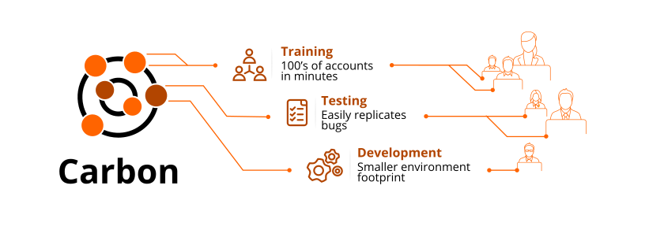

______
## Introduction
Carbon is an easy to utilize tool that allows rapid duplication of CCB and MDM accounts for training and testing. It is designed to simplify any project where identical or similar accounts are required. Carbon provides a simplified and consistent environment that students can use for practice multiple times, or enabling testers to replicate problematic accounts in a development environment allowing simple and streamlined approach to solving the issue.
## Guide
This documentation provides information on Carbon by Intellitect. 
* <a href="./Training/Training.md">Training</a>
* <a href="./Testing/Testing.md">Testing</a>
* <a href="./Development/Development.md">Development</a>
