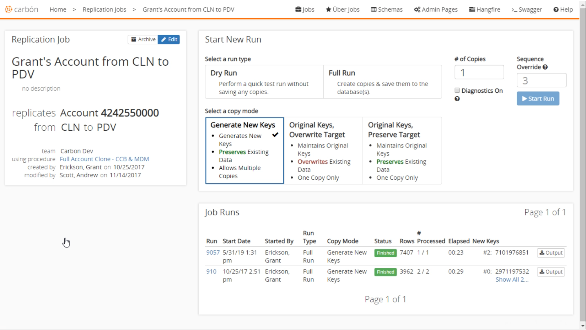
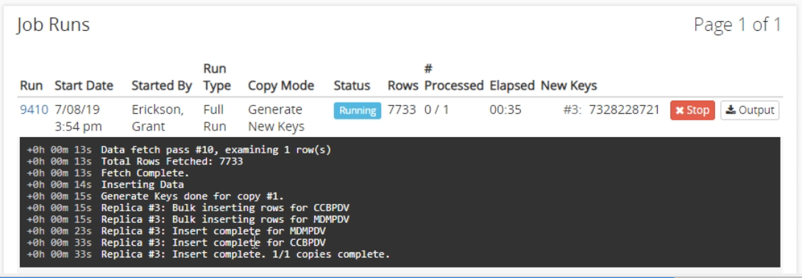

# Replication Jobs
Replication jobs are the core of Carbon. They are jobs that perform all the account information fetching and create the replicated accounts. There are multiple ways to create new replication jobs but they all come down to finding an existing CCB or MDM account you want to replicate. Replication jobs are extremely useful for creating one or two replicated accounts, to replicate more see [uber jobs](Uber-Jobs.md).

## Creating a Replication Job
To get started configuring a replication job, you must first select an account. The easiest way to find an account to start with is to use the [search](Application-Home.md#Search) feature from the home screen.
After you have selected an account to replicate you should see the start new run screen.

---
### Information Section
The information section is located in the upper left hand corner of this page. It displays detailed information about this account. You can click the edit button to change things like the team, source environment, target environment, and starting key. You can archive this account which will hide it from the interface. It cannot be permanently deleted as there may be other accounts that were cloned from this account.

---
### Start New Run
The start new run section is used to configure how Carbon is going to perform the replication on the account.

#### Run Types
There are two run types to select from. 
**Dry run** will perform all the steps of the replication without actually committing the clones into the target database. It is used to ensure the job will succeed, but it usually does and is rarely used. Dry run can also be useful for some testing scenarios.
A **full run** will fetch all the associated records for the selected account and then create the cloned account. This clone will be fully committed the target database.

#### Copy Mode
There are three copy modes that determine how Carbon copies the account. Select the copy mode that best works for the scenario you would like.

* Generate New Keys
  * Generally the safest form of copying. All keys are generated and the source account data is copied without any relationship to the existing account. This is the only copy mode supporting more than one copy at a time because its keys are unique.
* Original Keys, Overwrite Target
  * This will keep the original keys and data identical to the source. This is useful for transferring data to an environment that does not already contain existing data, or you want to override the existing data like pulling a production account into a development environment. Because it is an exact copy of the original there can only be one in the target database.
* Original Keys, Preserve Target
  * This will keep the original keys but will not overwrite the target data. If any rows are in the source database but not the target, they will be copied. Similar to copy mode 2, there cannot be more than one copy at a time.

After all the options are set click the start run button to start the job. 

---
### Job Runs
All previous run jobs will appear in this section. They include information about the job like number of rows copied and number of account affected. While a job is running it will show real time details about the process including the various number of rows fetched, and rows being inserted into the target. You can also stop a job while its being ran.

After the run has been completed the details will added to the list. There is an option for recently completed jobs to roll back which will undo any of the actions performed by the job. Here you can also get an output of the job detailing the statistics of the account as well as anything that is attached to the account
