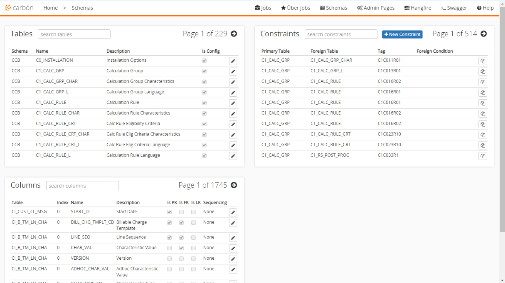

# Schema Explorer
Carbon uses the relationship between data in the database, the schema explorer allows users to view the structure and relationships of the data in a database. It is accessed from the toolbar at the top. You can select a table to see the specific columns contained. If you select a column, the constraints can be viewed as well. Any columns that are a primary key, foreign key, or linked key are also marked. You can search for any of the items and even edit them directly from this tool. Unlike other schema explorers, Carbon's schema explorer will show tables that are not in the Oracle documentation. It provides a simple and concise way to view everything about your database schema.

