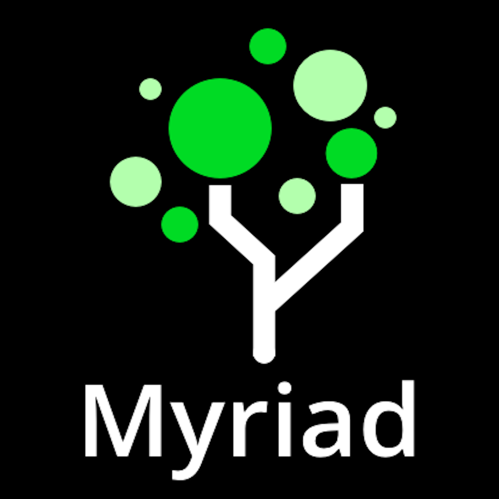

 
# IntelliTect Products 
 
|[Carbon](docs/Carbon/Index.md)| | 
| ----- | ----- | 
| | Carbon rapidly duplicates CCB and MDM accounts for training and testing via a web-based interface. This product decreases training preparation while providing a consistent and simplified environment that students can practice in multiple times. Carbon also allows testers to replicate problematic accounts in development environments so that issues can be fixed promptly.   Carbon is designed to simplify any project where identical or similar accounts are required. It is utilized by trainers, testers and IT management daily.   [Learn More](docs/Carbon/Index.md) | 
 
|[Trellis](docs/Trellis/Index.md)| | 
| ----- | ----- | 
|| Trellis is a web-based configuration tool designed for large enterprise applications. It allows users to track and affect change within and between environments in an efficient manner while limiting human errors—at the click of a button. Additionally, snapshots of the configuration data are periodically recorded and users can be alerted if changes are made.   With Trellis, Managing configurations no longer has to be a time consuming and error-prone process. It's a valuable addition to any team using CCB or MDM.   [Learn More](docs/Trellis/Index.md) | 
 
|[Myriad](docs/Myriad/Index.md)| | 
| ----- | ----- | 
|| Myriad is a project coordination and information dissemination tool that combines the best of Microsoft Excel, SharePoint, Microsoft Project, and Slack. The program ensures every team member has access to up-to-date information about all applications and environments, including their statuses, schedules, and real-time collaboration efforts.   Myriad is used every day by developers, testers, trainers, operations personnel, business users, IT management, and corporate management.   [Learn More](docs/Myriad/Index.md) | 

