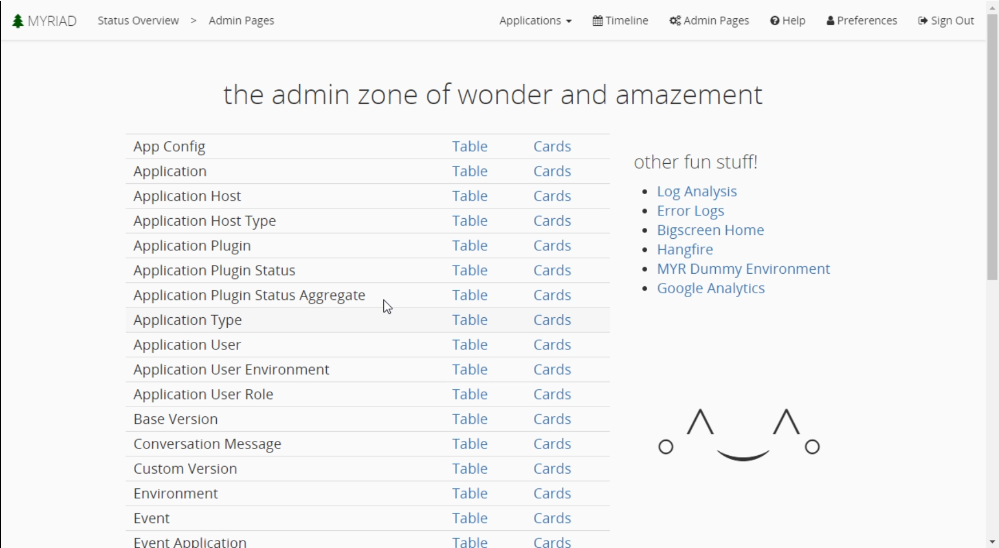
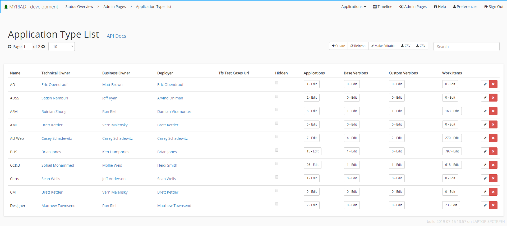

# Admin Pages
The admin pages in Myriad allow you to control and configure the application. Many of these options are not needed because their functionality is exposed through the main application. To navigate to the admin pages click the `Admin Pages` button in the toolbar at the top of the screen. The admin page links are broken up into two columns, 'Table' and 'Cards'. Table is used when configuring Myriad on a desktop computer Cards is used when configuring on a mobile device or tablet. 

There are many options listed here but the most commonly used ones include Environment, Event Type, Release Version, and Application User.

---
## Application Types
Application types are used to define what kind of program an application is. You can use these types to easier identify what applications are used in specific environments. These are a required field for creating a new application. To set up a new application type, select the `Application Type` link from the admin pages. This will bring you to a table of all existing application types. This provides most of the information about each application type like name, owners, deployer, as well as an `Applications`, `Base Version`, `Custom Version`, and `Work Items` buttons. Each of those buttons shows the number of that item this application type has. Clicking those will bring you to the respective list. ie `Application` will bring you to the application list displayed under the application admin page except it is filtered to only this application type. There are also edit and delete buttons. View more information about application types click [here](Application-Types.md).

To create a new application type navigate to the application type list and select the `+ Create` button located above the list. Simply enter the expected fields and add any additional details like work items. Thats it, you can now use this application type.

---
## Applications
[Applications](Applications.md) are the reason we use Myriad. They are the things we are building and maintaining. Each application has types, events, and work items etc. When you first click the `Applications` button from the admin page, you are presented a table of all applications you have in Myriad similar to the application type list above. Here you can see each applications high level information like name, environment, type, hosts, versions, owners, as well has buttons for `Application Plugins`, `Work Item Associations`, and `Test Runs` each of which will bring you to the respective lists filtered for the specified application type. These lists can also be accessed from the admin page in an unfiltered form.

To create a new application to be managed by Myriad, you must have administrator privileges. First make sure you have an application type defined, then select the `+ Create` button located above the application list found off of the admin page. Simply enter the fields and any additional information like work items and that it, you can now set up [events](Events.md) to get to work.

---
## Application User
The application user screen allows you to view and manage all users accounts.
You can edit account information like, name, username, email, icon color, and user role by clicking the edit button in the right side of the table. You can also delete users by clicking the red `x` in the right-hand column.

#### Application User Role
The application user role is used to give privileges to specific users. By adjusting this in the `Application User` admin menu you can add or remove privileges. There are several commonly used roles including 
* Administrator
  * This allows the most control over the application like defining and editing tasks to creating new applications and users.
* Environment Manager
  * This role is used for someone that creates, modifies, or maintains environments.
* BigScreenSinglePage
  * This isn't particularly used for a person, but rather a station. This will redirect the website to the big screen mode displaying status's that can be viewed from the admin menu.

---
## Environment
The environment admin page is used when you need to create a new [environment](Environments.md) in Myriad. Navigate to it by selecting the `Environment` link on the main admin page. Any existing environments will be displayed here along with their basic information like description, release version and owner.

In the right-hand column for each existing item there is an `Action` dropdown that is populated with any commands available like 'Calender Event'. To the right of that there is an edit button that allows you to edit the details about the environment. The edit menu is the exact same as the add new environment that is opened by clicking the `+ Create` button located above the environment list. 

---
## Log Analysis
The log analysis allows you to see problems that are occurring within the Myriad system. Generally this isn't used often. It displays the error, if it is a newly occurring error, its level (warning, error), the error message, and the details exception that was thrown. You can access it by clicking the `Log Analysis` button on the right-hand side of the admin pages.
