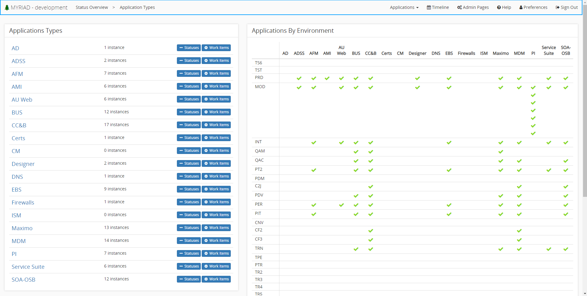
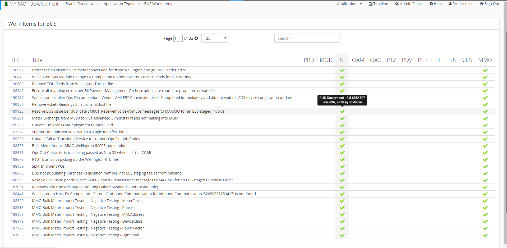

# Application Types
In Myriad, any application must be a specific application type. This allows you to coordinate where each implementation of an application is. To add an application type do so in the [admin pages](A)

---
## Applications by Environment 
Located on the right-hand side of the application types screen, this graph displays what applications are contained in each environment. This provides a simple and concise way to view where applications are. This can be extremely useful if you have multiple applications in an environment that share resources or URLs. If one application has a problem with the shared resource, you can use this graph to determine other applications that may have the same problem.

---
## Application Types List
You can navigate to the application types screen by selecting `Application Types` from the dropdown that says 'Applications' located in the center of the toolbar. Here you can see a list of all application types in Myriad. For each of these types, you can see the number of instances there are, as well as a `Statuses` and `⚙ Work Items` buttons.   

---
### Work Items
Myriad is connected to TFS/Azure and allows the integration of work items. Selecting the `⚙ Work Items` button for a specific application type will open the work items screen. Here you can see all the work items for all the applications with this application type. It is useful to see all the work items in a single space across various environments. Quickly identify what work items have gone to development, production, etc. 

You can search for specific items, as well as select a work item to view it directly in TFS/Azure. To learn more about adding work items see [event work items](Events.md#work-items).

