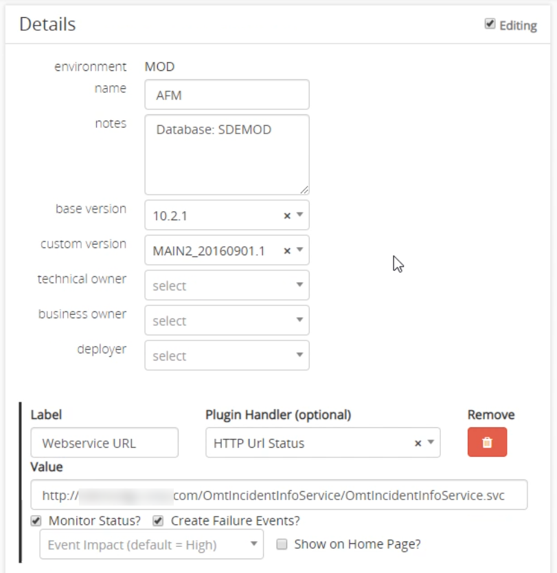

# Applications
Applications are the whole reason we use Myriad. Applications are the projects that need to be completed. You can set up [Events and Tasks](Events.md) that lets you manage the who, what, and when of the production process. You can see its history, and previously completed events, and impact. To create a new application you first need to have an [Application Type](Application-Types.md) and then create the new application in the [Admin Pages](Admin-Pages.md#applications).

---
## Application Screen
To open an application and view its details, you can find and click the application from many places including the [Environment](Environments.md) details screen, and the event screen if the event impacts the application. At the top you can see the environment, application name, status and impact.

---
### Events
Similarly to the environment screen, the events list is on the left hand side of the screen. It is used to view and edit events that are in this environment. At the top of the events section the pending events are displayed, and below those are the past events. You can search past events using the search bar provided. If you have the permissions you can edit these events or add new ones. Click an event to [view it in detail](Events.md).

In the Pending section you can finish an event preventing its status from impacting the status of the environment. In the past events section you can start events and they will start effecting the status of the environment. Learn more about [events](Events.md).

---
### Details
The detail section provides details on this particular system. All the basic information is supplied at the top including the application and environment names, the versions, and owners. Below the basic information, any plugins enabled for the application are listed. In this example there is a plugin configured that tests urls and makes a status indicator next to them in the application screen. See more on [Plugins](#Plugins) at the bottom of this page.

### Hosts
Hosts can be seen and edited and is located below the Details pane. This is a completely optional section that allows users to enter specific information on hosts of the application. The name, IP address, computer processing used, and purpose can be changed here. It allows all the host information to be easily viewed with all the other application information. There can be host-specific plugins that allow more explicit control of the host.

---
### Editing Details
To edit the details on an application you must first have administrator privileges for the application. If you are authorized, by clicking the `Editing` checkbox in the upper right-hand corner of the details pane, we can then edit the basic information about the application. 

**Plugins** can be added by clicking the  `Add Property/Plugin` button at the bottom of this section. You can specify the 'Plugin Handler' such as "HTTP Url Status" and continue to configure the fields with the details specific to each plugin. 

---
### Plugins 
Plugins provide a way to extend the functionality of Myriad for a specific application or host. There are several different plugins that are commonly used and their configuration is listed below:

HTTP URL Status Plugin 
* Will automatically check the accessability of the URL provided and change the impact of the application. 
*  `Monitor Status?` button will make Myriad poll the URL on regular intervals to ensure it can be reached. The website status will be displayed in the details pane when this is enabled. The
*   `Create Failure Events?` checkbox will cause Myriad to automatically create an event that's status is down. By default the URL must be determined to be down three consecutive times before the event is created. The failure event causes the status of the whole application to go down so you can quickly identify and fix the problem. 
*   Lastly you can change the impact the URL accessability has on the application if failure events are enabled. 
*   You can also allow this plugin to appear in the home and environment screen as a main URL. 

Plugins can be configured from the [Admin Pages](Admin-Pages.md)
---
### View Trends
Using the trends page you can view trends of plugins over time. To navigate to the trends page, click the `View Trends` button at the bottom of the details pane. In the case of the URL status plugin, you can view graphs of the website response times. This tool provides a simple way to view data without purchasing another tool. On the left-hand side you can change data and time span to further narrow down the type of data you are viewing. All the data used and displayed here has been collected from the previous 90 days.

