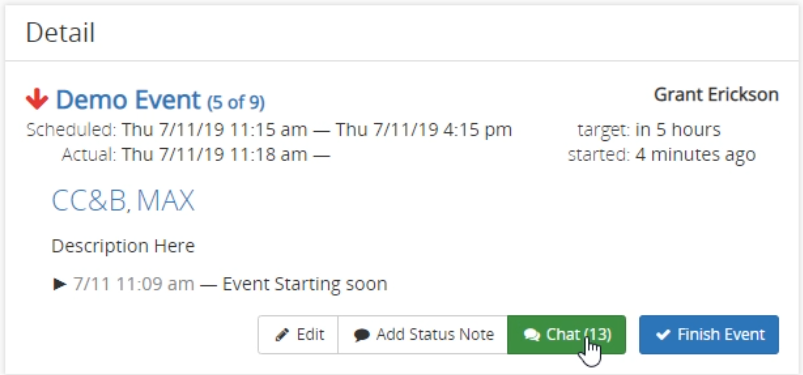
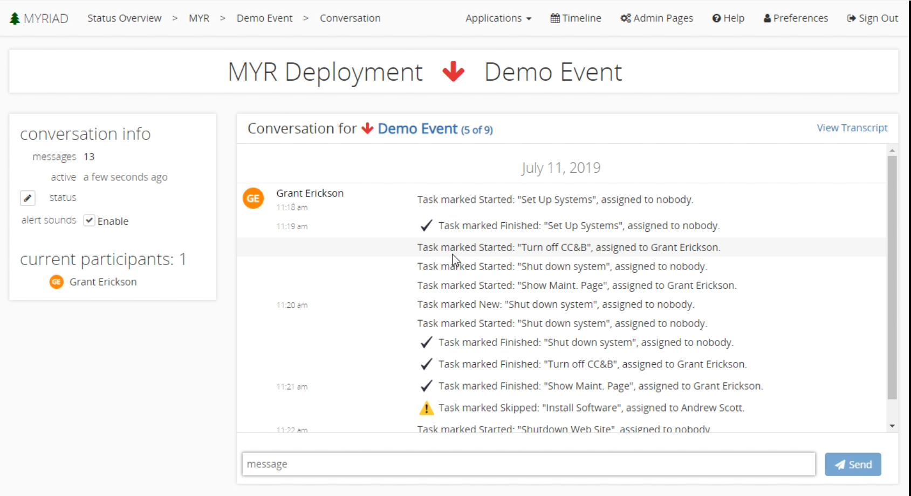

# Chat Section
Myriad has a chat feature that allows a simple way to notify your team about current events and progress. You can open chat by using the `Chat` button in the details section when looking at a specific event. The number in parenthesis inside the button represents the number of messages within the chat. A nice feature about Myriad's chat is that unlike many other enterprise chat solutions, it is persistent making it very difficult for people to catch up on missed items. 

## Using The Chat
From the chat screen you can view all the messages in the 'Conversation' section. Here, all the messages will be shown in the text box and are dated. In the upper left-hand corner you can change your status, and enable/disable alert sounds for new messages.  

