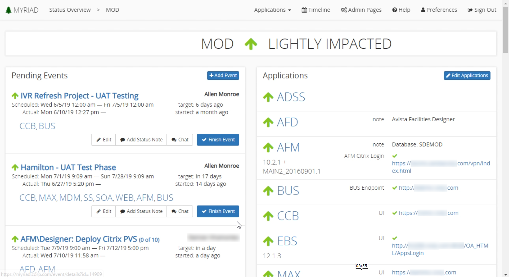
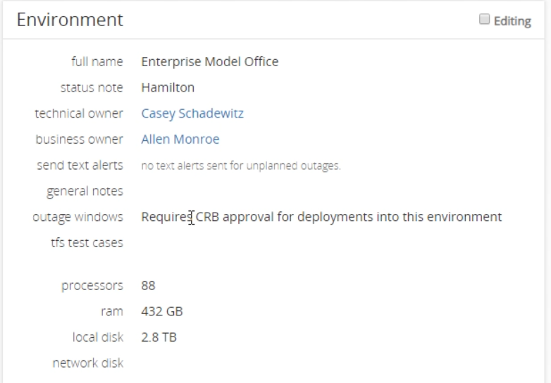

# Environments
The environments screen provides detailed information about the selected environment. At the top it displays the status as well as the environments impact ie how much use it is receiving.

---
## Events
The events are located on the left hand side of the environment screen. It is used to view and edit events. At the top of the events section the pending events are displayed, and below those are the past events. You can search past events using the search bar provided. If you have the permissions you can edit these events or add new ones. Click an event to [view it in detail](Events.md).

In the Pending section you can finish an event preventing its status from impacting the status of the environment. In the past events section you can start events and they will start effecting the status of the environment. Learn more about [events](Events.md).

---
## Applications
This section on the right hand side of the screen lists all the applications for this environment. You can view notes as well as view any links for the application. You can enable website status icons that indicate if the website is currently accessible. You can configure the environment to automatically change event statuses if a URL goes from accessible to inaccessible. This allows a history to build automatically, as well as change the status of the entire environment.

---
## Environment Details
The environment details section is located below the applications list. Here you can view details about the environment like the name, owners, tests cases, and general compute like the number of processors, ram, and disk storage.

