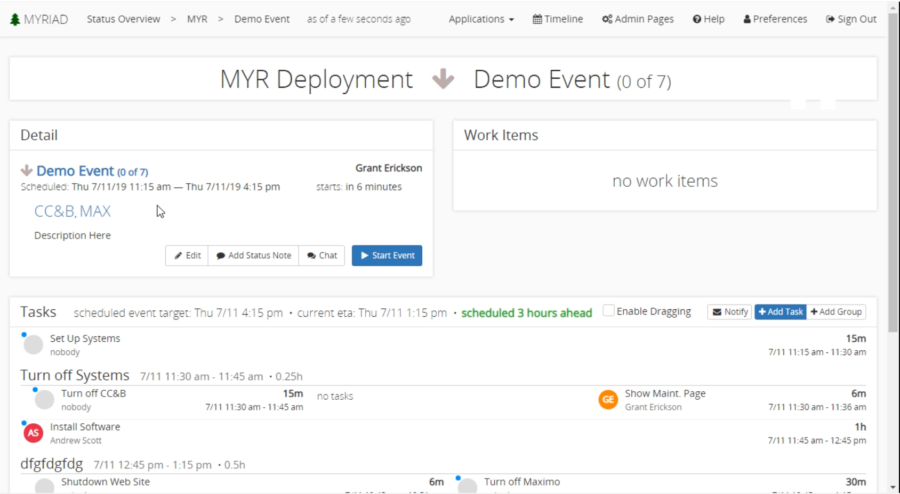
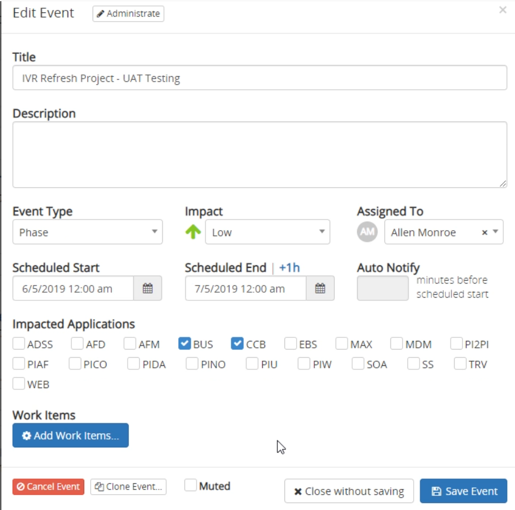
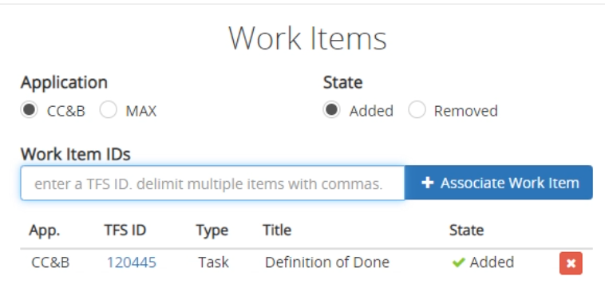
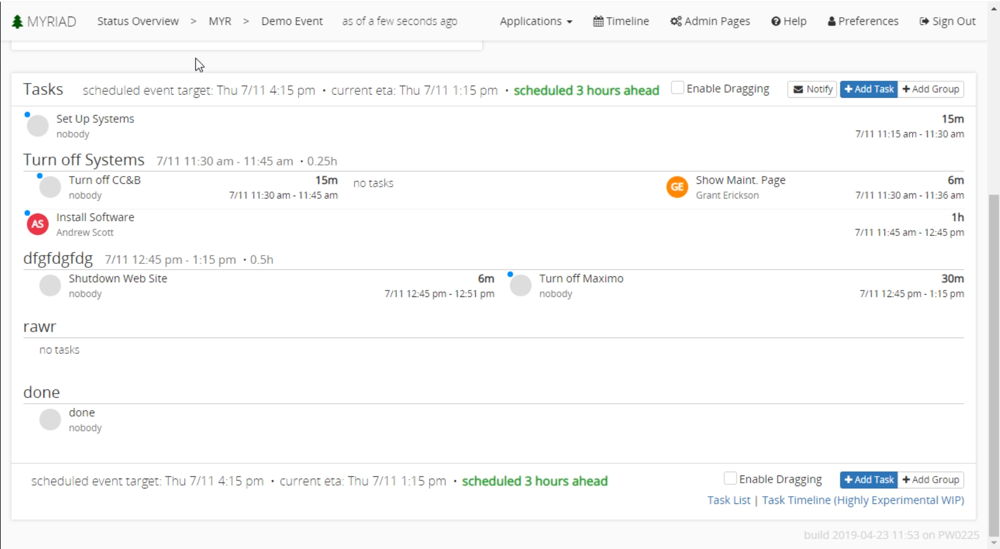
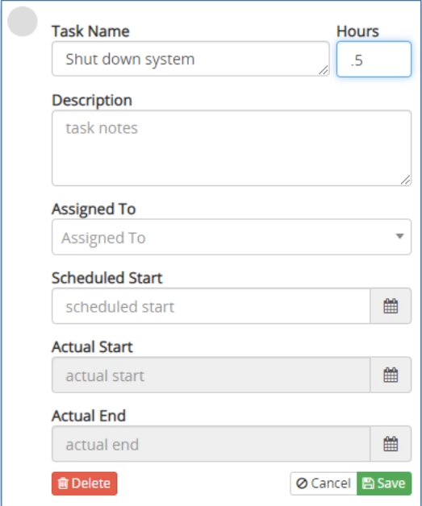
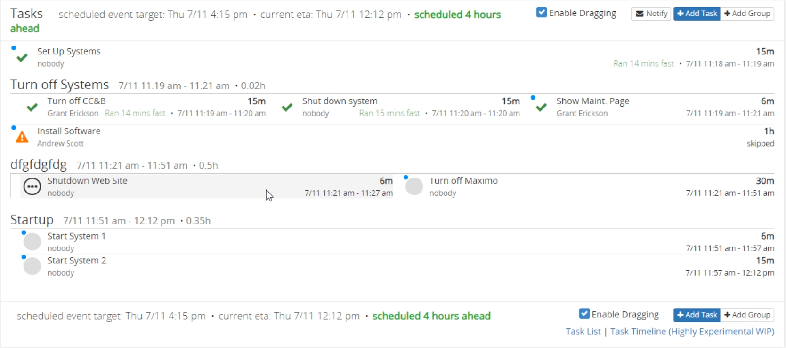

# Events
Events are the core of Myriad. They allow users to coordinate when things will happen for each environment. An event usually contains tasks that detail the exact steps needed to complete the event. Only proper authorized users can edit events or an events tasks. For many people this serves as an easy way to see what they need to do and when it needs done. You can also send email notifications to everyone that has an assigned task so users are always up to date.

## Viewing Events
To view an event simply click it from the location you see it. Here is where you can configure events. 

---
## Details
In the top left of the event screen you can see details about the event. Here you can view any of the high level details about the event including the status, status notes, the schedule and any systems that are impacted by this event. The scheduled end time is shown here, any updates to the scheduled completion of tasks will be reflected in this time as well. 

There is also buttons that allow the user to edit the event, add status notes, or open the [chat](Chat.md). If an event is not currently running, you can start the event. This will cause the event's impact and status to effect the environments impact and status. 

---
## Editing Events
To edit an event from the event detail screen simply click the `Edit` button. Here is where most of the event is configured.
Administrator users can open additional options at the top. The title or description can be either set or changed. The event phase can be set but is for nothing more than clarity. The impact of the event can be changed. The user assigned to the event can be assigned as well as the scheduled start and end times. 

If the event is running, you can set up auto notification here, or mute the currently set up notifications. The impacted applications can be set so it is clear what applications are being effected by this event. Any work items can be added from this menu. Events can also be cancelled, cloned, or altered and saved in this section.

### Work Items
Myriad has an integration with Microsoft Azure Devops that allows you to add work items from Devops to events. To add new work items you first must go to the edit event screen. From here there is an `Add Work Items` button that opens the work item section. 

This is a simple area that lets you add work items by the Azure Id. You can select either CC&B or MAX system to add the item to. Multiple work items can be added at once by entering them as a comma separated list. Any existing work items show up here and can be removed easily by clicking the red X. The state of the work item is usually set to "Added" but sometimes it may be useful to remove a work item from the environment by having an event.

---
## Event Planning and Tasks
Tasks are set up similarly to other planning softwares. If you are familiar with Gantt charts, this section is very similar except it is has a rotated orientation. The main idea is that it runs top to bottom. Anything tasks that are stacked makes the lower task a dependant of the upper one. If there are multiple tasks in a row it means they are being done concurrently. If there are dependents of concurrent tasks, all the concurrent tasks must be completed before the dependant task can be started.

In the example below in the "Turn Off Systems" group there are several concurrent tasks and they have one dependant. That means the "Turn off CC&B", and "Show Maint.Page" tasks can run at the same time while the "Install Software" task must wait for those two to be completed before being started. 

### Notifications
In the upper right hand corner of the tasks section there is a notify button. Clicking this will send anyone that has an assigned task an email detailing their task. It serves as a simple way to make sure everyone is aware of their task and when it needs done. 

### Critical Paths
You may notice the blue dots next to specific tasks. These dots represent the critical path. The critical path is longest sequence of dependant tasks that must be completed in order for the project to get done on time. If there are concurrent tasks, there can be multiple items on the same level that make up the critical path if they finish at the same time. The critical path can also be affected by manually scheduled task times. If a scheduled time makes that task finish later than any other task, it is part of the critical path.

### Task Groups
Tasks can be organized by moving them into task groups which are used group similar tasks. You can add a group by clicking the add group button in the upper right hand corner of the tasks section. A group name is the only requirement, but you can also specify a scheduled start time and enable child parallelism. Child parallelism makes any task within that group to be a concurrent task. Groups that have child parallelism are shown with a ||| symbol next to the task group name. You can achieve parallelism by adding columns to a group as well, but if a group only contains concurrently running tasks, child parallelism is considerably faster and easier to read. To add a column click the ellipses (...) next to an existing group.

If a task group is being deleted. You will be prompted to confirm that all dependencies of that task group will also be deleted. If you want to keep those tasks, move them out of the group to be deleted.

### Tasks
Tasks detail what work needs done, Who is going to do the work, and the amount of time it needs completed in. Tasks can be added by clicking the add task button in the upper right hand corner of the task section, or by clicking the ellipses (...) next to an existing task group. Most of the fields are optional except the name of the task and its length in hours. Usually .1 hour is used as the minimum task length (6 minutes), however Myriad supports lengths as short as one minute. 
If someone is assigned to a task, their initials will be displayed in the icon next to a task, as well as full name below the name of the task.

 

If a task is not in the correct location you can move it by checking the enable dragging checkbox at the top of the tasks section. This is disabled by default because it can be easy to make unwanted changes to the tasks. 

You can mark tasks as started, finished, or skipped. This will adjust the times of dependant tasks. If a task is marked as started by mistake, you can mark it as new to restore its state to un-started. Tasks that are marked as skipped will be displayed with a warning symbol next to them. When a task is finished early the UI will display how much faster it ran than the scheduled time. These UI updates make it easy for an entire team to see the status of the project and can be seen in the example below. 

A task is considered "floating" if it does not have a scheduled time. If a preceding task is manually started, skipped, or it was marked as finished before it was scheduled to finish, any dependant floating tasks will have their times updated. By default tasks are floating. This can be changed by manually setting the scheduled start time for a given task. Setting the start or end times will affect the scheduled times of any dependant task as well as the critical path.

 
