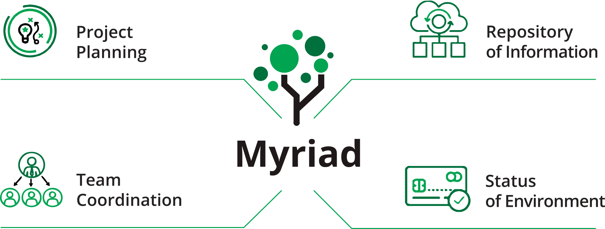

______
## Introduction
Myriad is a project coordination and information dissemination tool that combines the best of Microsoft Excel, SharePoint, Microsoft Project and Slack. The program ensures every team member has access to up-to-date information about ll applications and environments, including their
statuses, schedules and real-time collaboration efforts. Myriad is used every day by developers, testers, trainers, operations personnel, business users, IT management and corporate management.

## Getting Started
This documentation provides information on Myriad by Intellitect. 
* [Project Planning](Getting-Started/Project-Planning.md)
* [Team Coordination](Getting-Started/Team-Coordination.md)
* [Repository Information](Getting-Started/Repository-Information.md)
* [Status of Enviornments](Getting-Started/Enviornment-Status.md)
