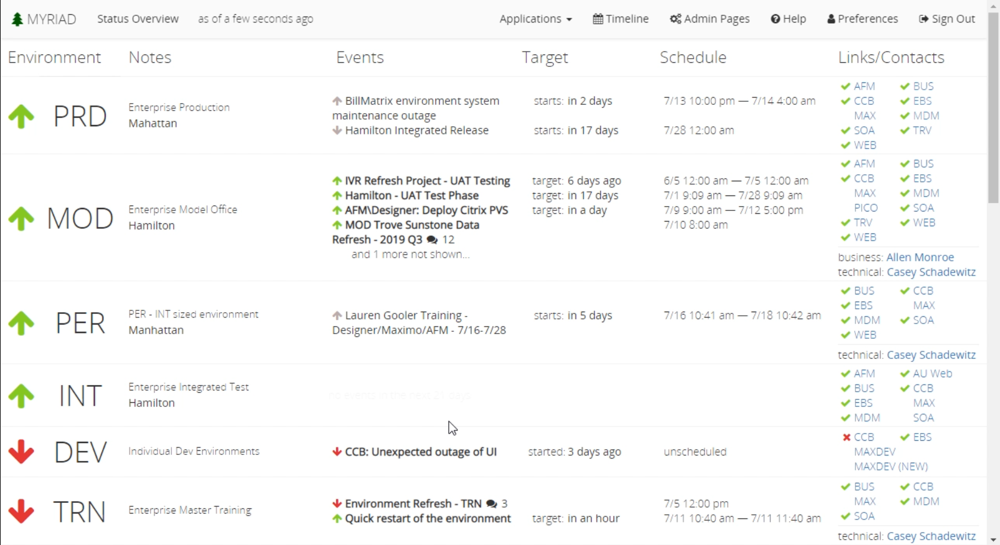

# Status Overview
This page provides a status overview of your applications. Each environment is displayed in the list and contains high level information like recent events

Status
* Green up arrow means the environment is working properly
* Yellow sideways arrow means the environment is up, but there is something compromised.
* Red down arrow means the environment is completely down.

There are notes for each environment and may include the type of production and location. The events column displays events that are either ongoing or are upcoming. The target and schedule columns display when the event is going to take place. The links/contacts column are just convenience links to individual tables and shows their status.

## Title Bar
The title bar displays the page you are currently working on as well as how long ago it was updated. This section also contains some navigation options to 
[admin pages](Admin-Pages.md), [timeline](Timeline.md), [preferences](Preferences.md), help, and the sign out button.

