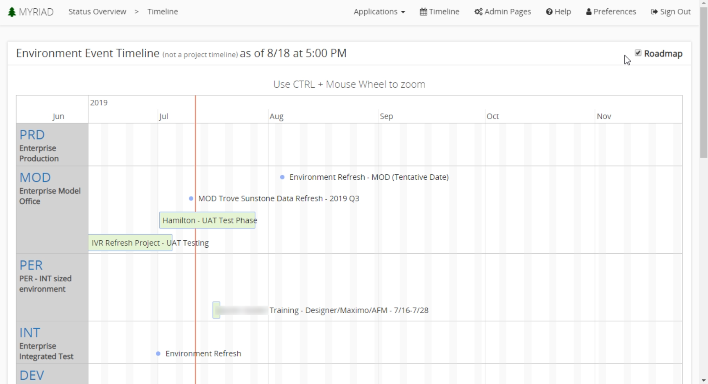

# Timeline Roadmap
The Myriad timeline roadmap is used to view high level events for each environment in a simple and easy to coordinate view. It is most useful for eliminating most of the noise associated with all the data and events in your applications. Phases and some individual data points can be seen. You can access the timeline by selecting the `Timeline` menu option in the tool bar at the top. 

## Timeline
To view more detailed information you can turn off the roadmap by selecting the `Roadmap` checkbox in the upper right-hand corner of the timeline screen. This will show all events for every environment and how they stack up. They are displayed vertically, or in a row for concurrent events. This provides and excellent overview. You can select an event to view additional details or navigate to the [Application](Applications.md) or [event](Events.md) screen. 