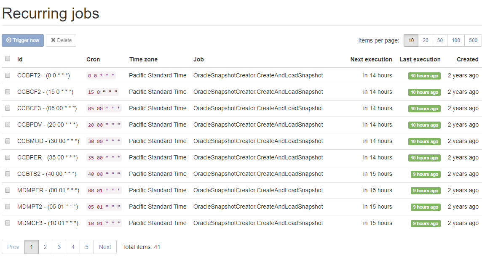

# Admin Pages

The admin pages are used to view and configure the support data for Trellis. Here you can add users, assign roles, create databases, define schemas and much more.

## Admin page

To open the admin page click the `Admin Pages` button from the upper right-hand corner of the applications page.
You are greeted with a list of options each of which has a Table and Cards column. Table is used to configure Trellis for use on a desktop, and Cards are used to configure Trellis for use on a mobile device.

---

# Setting up a Database

To set up snapshotting of a database you must first have an Application Type and a Schema. Select the Database option from the Admin Page.

- Here is where you setup basic database information like the name and Oracle connection string. The connection string should be in this format: `data source="(DESCRIPTION=(ADDRESS=(PROTOCOL=TCP)(Host=[hostname])(Port=1521))(CONNECT_DATA=(SID=[SidOfDatabase)))“`
- The read only username and password fiels are used to authenticate a connection to the database.
- At the bottom you can take a snapshot immediately, schedule recurring snapshots, or test the database connection.

 

## Recurring Snapshots

Recurring snapshots are used to automatically take a snapshot of a database daily. To schedule recurring snapshots, navigate to the bottom of the database admin page, select `Schedule Recurring Snapshots` and you will be prompted for a 'Cron String'.

- The format of the 'Cron String' is always `0 <minute> <hour> * *` where hour and minute make up the daily time to take the snapshot. Eg `0 30 11 * *` would setup the snapshot to be taken at 11:30 every day.
- After the job is scheduled look at the [Hangfire](#Hangfire) page to ensure the recurring snapshot is setup and manage it.

# Schema Table Selector

The Trellis schema table selector allows you to configure which tables in a database are enabled for snapshotting.

- To use the Schema Table Selector you first need a [Database](#Create-a-Database).
- You can then select the `Schema Table Selector` option on the right hand side of the screen.
- You are prompted to select a schema for a particular Application Type.

 

Next select a database from the dropdown. A list of tables in the selected database will appear. You can enable or disable these tables. If a table is enabled, it will be used in both automatic and manually triggered snapshots.

# Hangfire

Hangfire is used to run the underlying Trellis jobs accessed off the admin pages. You can use this screen to view all jobs, recurring jobs, and failed jobs. You can also view a history graph of previously run jobs.
If you select the `Recurring Jobs` tab, you can view all all the jobs that have been scheduled as well as helpful relevant information.

