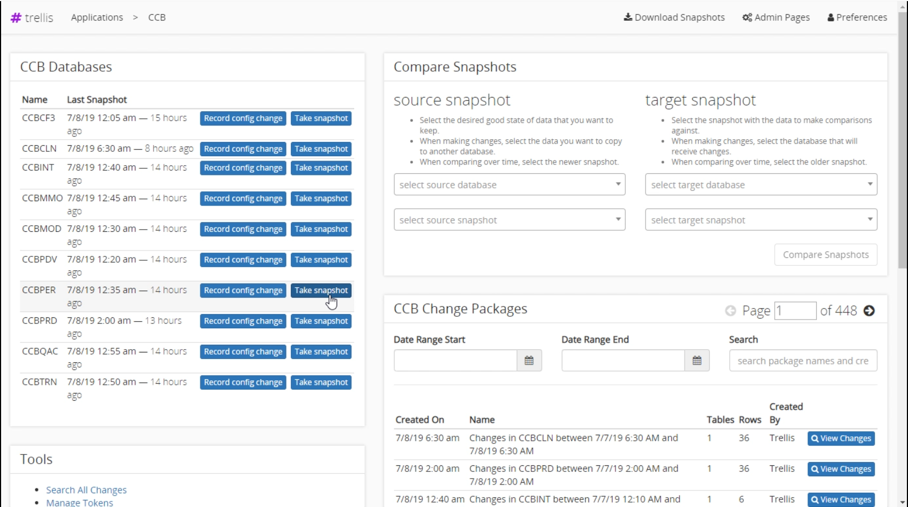

# Home Screen
The home screen for your application. is where almost all the work starts. Here you can take snapshots, compare snapshot, and view or search change packages. 

## Databases
Here is a list of all the databases you have configured for your application. Basic information like database name and time since last snapshot is displayed here. You can manually take a snapshot. To add [additional databases](Admin-Pages.md#Setting-up-a-Database) go to the admin page.

## Tools
This section contains some basic tools that may come in handy. The search tool allows you search for any changes that have occurred. The data search input will search for tables, column names, and values anywhere in the database. The table filter can be used to search within the specified table. Database filter lets you to search within the selected database. The date inputs lets you set the start and end dates to constrain the search. The results show the change made, person who made it, the date, and the package that caused this change.  

## Compare Snapshots
Compare snapshots allows you to determine the changes made between two different environments, or two different snapshots within the same environment. To create a snapshot comparison view [creating comparisons](Snapshot-Comparisons.md) for more information.

## Change Packages
Below the snapshot section you can view a lost of any changes that occurred within the application recently. You can search for names, or within a date range. For more search options use the search tool.