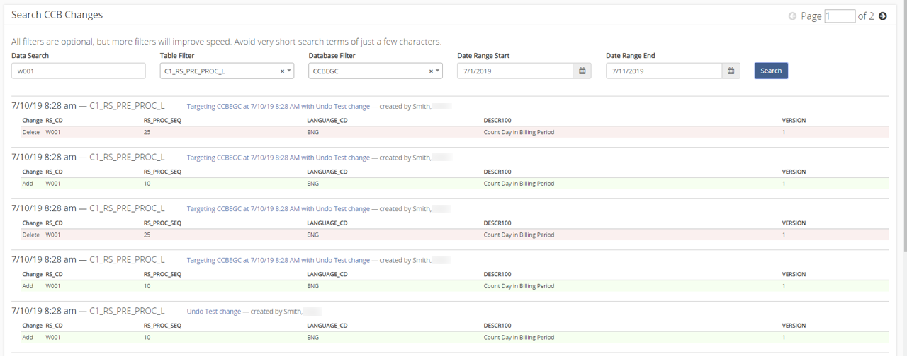

# Home Screen

The home screen for your application is where almost all the work starts. Here you can take and compare snapshots as well as view, search, and change packages.

## Header

The header bar is displayed at the top of the page. It shows the current page you are on, and has buttons to view the [admin pages](Admin-Pages.md) and [preferences](Preferences.md). You can also [download snapshots](Use-A-Package.md#Downloading-a-Snapshot) within the application.

## Databases

Here is a list of all the databases you have configured for your application. Basic information like database name and time since last snapshot are displayed here. You can also manually take snapshots. To add [additional databases](Admin-Pages.md#Setting-up-a-Database) go to the admin page.

## Tools

This section contains some basic tools that may come in handy. The [manage tokens](Use-Tokens.md) tool allows you to add and remove tokens for environment specific data. The search tool allows you search for any changes that have occurred. The `Data Search` input will search for tables, column names, and values anywhere in the database. The `Table Filter` can be used to search within the specified table. `Database Filter` lets you to search within the selected database. The date inputs lets you set the start and end dates to constrain the search. The results show the change made, person who authored the change, the date, and the package that caused this change.  

## Compare Snapshots

Compare snapshots allows you to determine the changes made between two different environments, or two different snapshots within the same environment. To create a snapshot comparison view [creating comparisons](Snapshot-Comparisons.md) for more information.

## Change Packages

Below the snapshot section you can view a list of any recent changes. You can search by name or date range. For more search options use the search tool. Learn how to create [Change Packages](Change-Packages.md).
