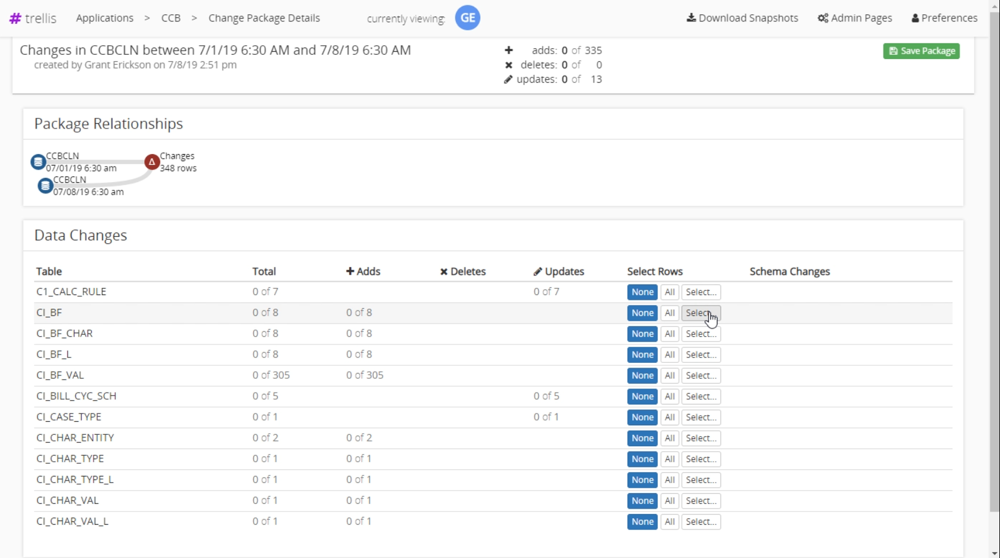
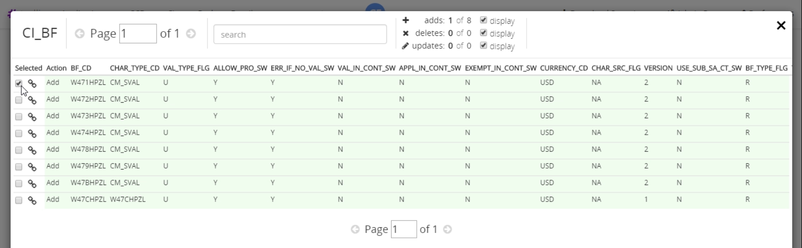
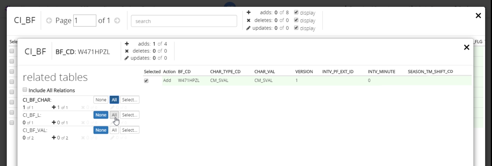
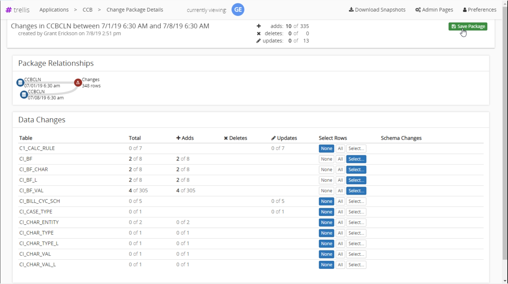
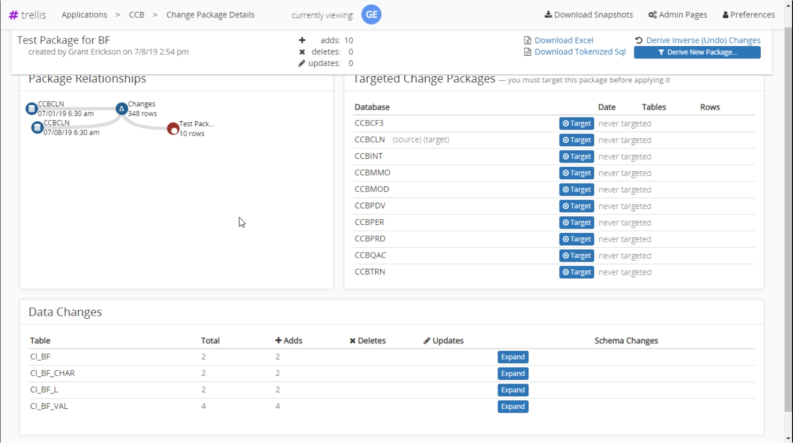

# Changed Packages

Trellis can be used to create packages that represent all the changes between snapshots or just a subset of them.

## Brief Overview

- Select the application you want to create a change package in
- [Create a Comparison](Snapshot-Comparisons.md) between the snapshots desired
- Click the 'Derive New Package' button in the upper right-hand corner
- Use the Data Changes section to select tables and rows to be saved in the change package
- Click the 'Save Package' button in the upper right-hand corner and specify a name for the package

---

## Creating a Derived Package

First you must [Create a Comparison](Snapshot-Comparisons.md) if you haven't already. From the resulting comparison screen select the 'Derive New Package' button in the upper right hand corner. This brings us to a changed package creation screen that allows us to select the exact changes we want to keep.

---

## Changed Package Overview Screen

In the data changes section, we can choose which table we want to keep changes from. We can select to keep all, none, specific changes within the table. We choose 'Select' to go to the table row selection screen.

---

## Changed Row Selection Screen

We can select rows we want to keep. If we want to also select specific rows related to a table item, click the button that looks like a chain to proceed to the related table row selection screen.

---

## Related Row Selection Screen

We can view the tables that have a relationship with this row. For each related table we can select all, none, or specific related rows to keep. By selecting any related rows, Trellis will automatically update the changed package overview screen with the tables and rows that are now selected.

---

## Saving the Change Package

After selecting 'All' for the related tables above, the changed package details screen is updated. All we have to do to save the selected changes is click the 'Save Package' button in the upper-right hand side of the header, and enter a name for the changes. In this case we named it "Test Package for BF".

---

## Viewing the Change Package

At the overview of the package, but instead of the changes being between 2 snapshots, it is of our newly saved changed package.

Notice we are looking at different data than the [initial comparison](#Changed-Package-Overview-Screen). In the 'Package Relationships' section, it shows the changes that we saved in addition to the two snapshots initially compared. The tables in the Data Changes section are only the ones we saves into the package named "Test Package for BF".

---

## Using the Change Package

Now that we have a change package saved you can [Use the Package]() TODO as if it were any other snapshot. The change package is also accessible from the 'Changed Packages' section of the application overview.
