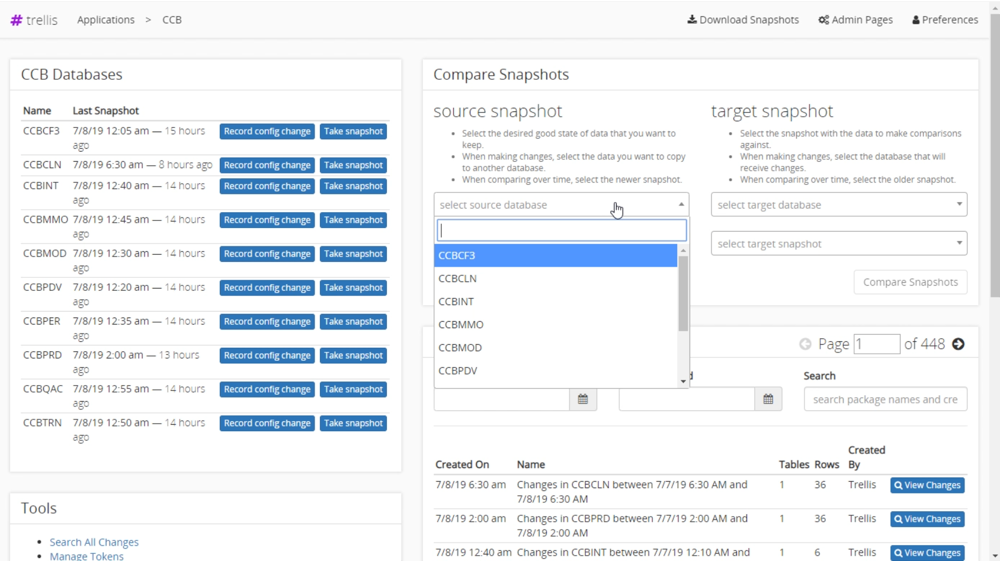
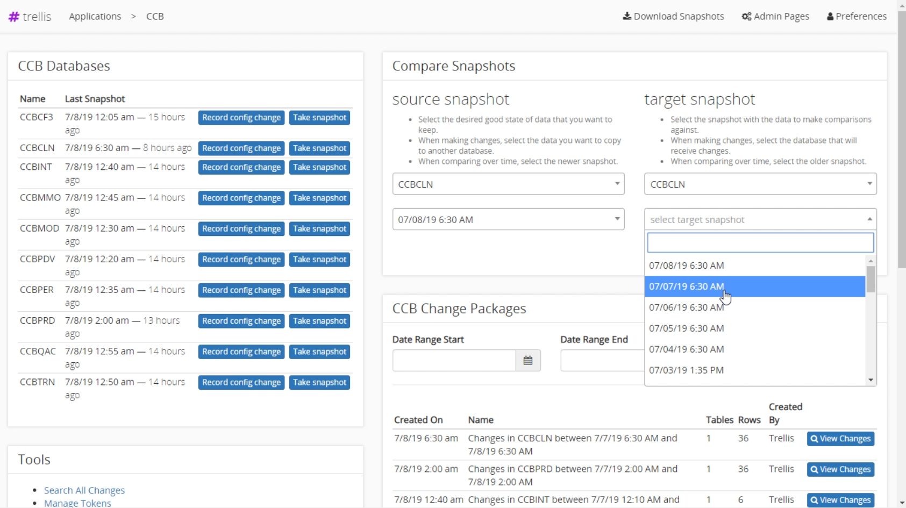
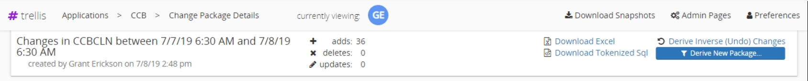
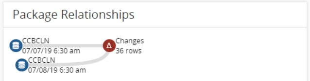
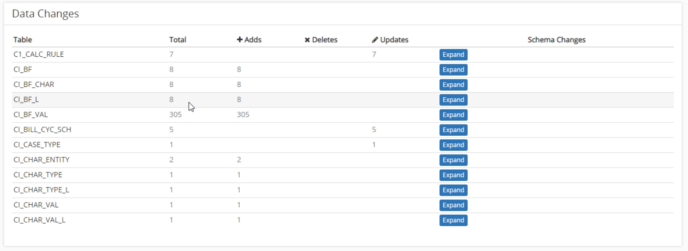
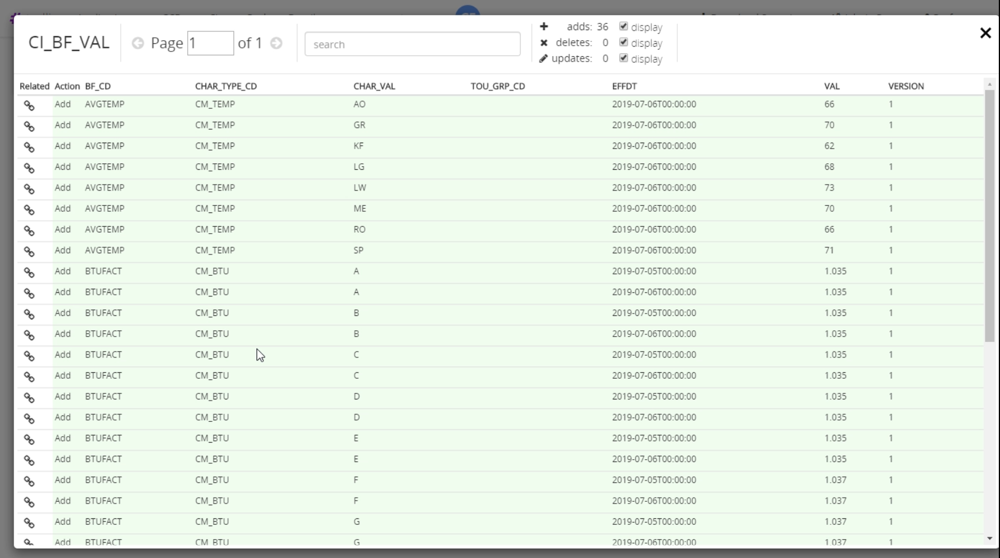

# Snapshot Comparisons
Trellis allows you to view the difference between two snapshots, or the difference between the same snapshot at two different points in time.

## Create Comparison
Brief Overview
* Open an application containing snapshots you want to compare
* Select the source database and the time stamp of when the snapshot was taken
* Select the target database and the time stamp of when the snapshot was taken
* Click the "Compare Snapshots" button
* Scroll down to the "Changed Packages" section to view the changes.

| Source Snapshot | Target Snapshot |
| --- | --- |
|  |  | 
| The source snapshot is the state of data you want to keep. This the newer snapshot of the two. | The target snapshot is the data source of the data you want to compare against.

## Viewing Changes
After the package changes are found, the screen will will update showing the changes. This screen is broken up into several main sections.

### Header
The header is displayed at the top of the screen and contains information about the comparison including the snapshots compared, the time ranges number of rows changed including the change type, and download Excell and download Tokenized Sql buttons.

### Package Relationships
The package relationships section displays the two snapshots being compared. The top snapshot is the target snapshot, and the lower snapshot is the source snapshot. The delta displayed all changes of any type.

### Targeted Change Packages
The targeted change packages section is used to move the changes to another enviornment. See [Change Migration](Excell-Output) for more information.

### Data Changes
This section displays the total number changes for each table changed between the snapshots. Click the expand button to view [detailed changes](#View-Detailed-Changes)

### View Detailed Changes 
The detailed changes section displays each row that was changed in the selected table. There are three ways the data is displayed
* Added rows are highlighted in green. 
* Deleted rows are highlighted in red. 
* Updated rows show the updated column value highlighted in both red and green cooresponding to the previous and updated data.
  
You can view or hide by change type, ie added, deleted, updated. You can search the changes to find specific items. 

---
## Download As Excell Document
To download a comparison as an Excell document you must first [create a comparison](#Create-Comparison). Then from the resulting screen select the "Download Excell" button loacated in the [header](#Header). This will start the download of the changes from the comparison.

---
## Download Tokenized Sql
To download a comparison as an Excell document you must first [create a comparison](#Create-Comparison). Then from the resulting screen select the "Download Tokenized Sql" button loacated in the [header](#Header). This will start the download of the changes from the comparison.
