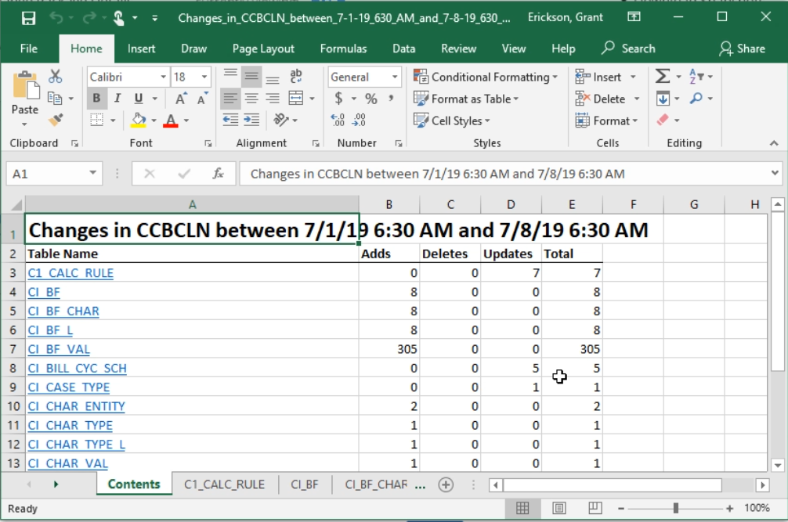
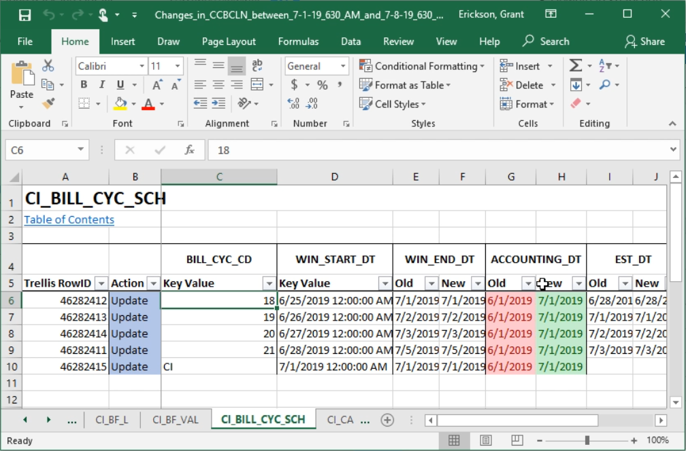

# Download an Excell File for a Snapshot or Change package
While Trellis makes it easy to view and track changes in many different enviornments, not everyone has it available. Luckily you can share this data using Microsoft Excell files.

* Start by creating or viewing [a Comparison](Comparing-Snapshots.md) or [Change Package](Creating-Change-Packages.md)
* From the change package overview screen select the "Download Excell" button in the upper righthand corner of the header
* Select the location to save

Now you have a concise, easily transferable copy of all the changes.

By selecting a table you can see specific row changes highlighted by change type. 

