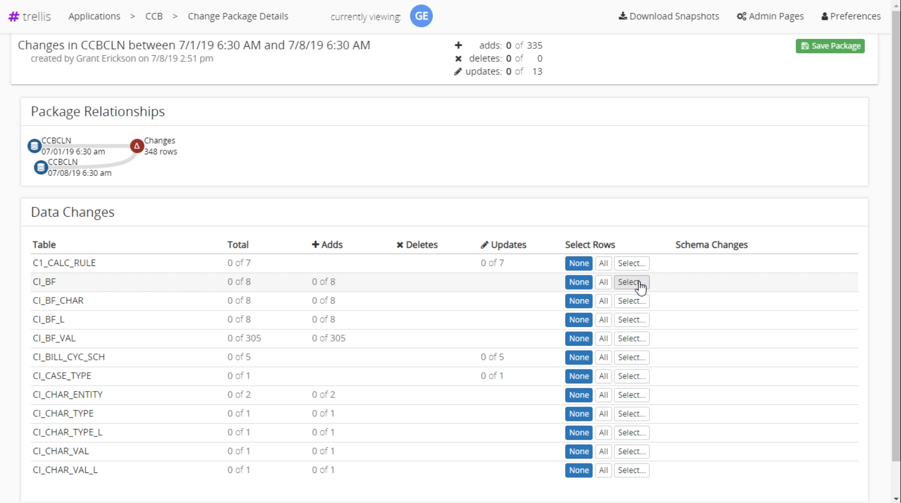
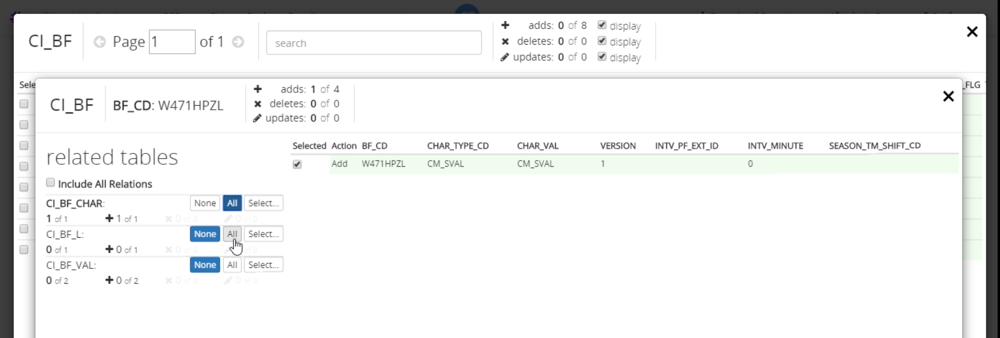

# Move comparison to another environment.
Trellis can be used to move changes between snapshots to another enviornment. You can move all the changes or just a subset.

## Creating a Derived Package
First you must [create a comparison](../Compare/Comparing-Snapshots.md) if you haven't already. From the resulting comparison screen select the "Derive New Package" button in the upper right hand corner. This brings us to a changed package creation screen that allows us to select the exact changes we want to keep.

---
### Changed Package Details Screen
In the data changes section, we can choose which table we want to keep changes from. We can select to keep all, none, specific changes within the table. We choose "Select" to go to the [table row selection screen](#Changed-Row-Selection-Screen). 

---
### Changed Row Selection Screen
Here we can select rows we want to keep. If we want to also select a specific rows related rows click the "Chain" button to proceed to the [related table row selection screen](#Related-Row-Selection-Screen).

---
### Related Row Selection Screen
Here we can view the tables that have a relationship with this row. For each related table we can select all, none, or specific related rows to keep. By selecting any related rows, Trellis will automatically update the [changed package details screen](#Changed-Package-Details-Screen) section with the tables and rows that are now selected.

