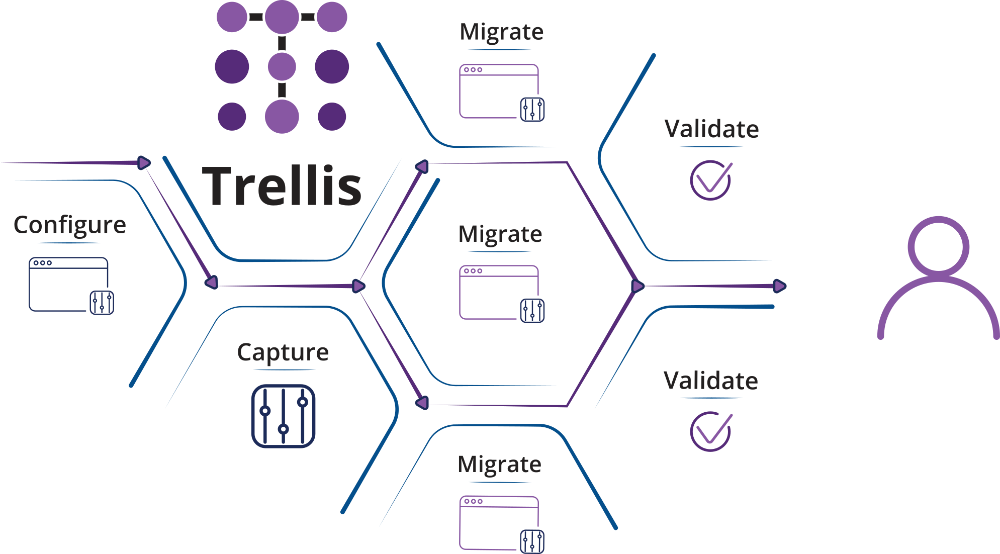

# Introduction
Trellis is a web-based configuration tool designed for large enterprise applications. It allows users to track and affect changes within and between
environments in an efficient manner while limiting human errors, all at the click of a button. Additionally, snapshots of the configuration data are periodically recorded and users can be alerted if changes are made. Trellis is a valuable addition to any team using CCB or MDM.

Trellis simplifies the process of managing OUAF configuration by:
* Automating configuration migration across environments through a simple, web-based user interface.
* Identifying configuration differences between environments over time.
* Auditing changes to the configurations and alerting the user with details about the changes.
* Tracking configuration changes to each environment by user and providing a robust “undo” capability

## Getting Started
### Compare
Trellis takes daily configuration snapshots of all
environments. This allows users to compare configuration
against any environment from any snapshot. Users can:

* [Compare the same environment](Compare/Same-Enviornment)
* [Create a simple Excel output of comparison](Compare/Excell-Output)
* [Program recurring tasks](Compare/Recurring-Tasks)
* [Organize Activity](Compare/Organize-Activity)

### Migrate
With Trellis, it’s easy to create change packages.
A snapshot is taken before and after UI or database configuration changes are made. Trellis automatically creates
a customizable package that will apply those changes or a
subset of them to other selected environments. Trellis can:

* [Handle fields with environment specific data](Migrate/Handle-Fields)
* [Select a subset of a comparison to move to another environment](Migrate/Move-Comparison-Subset)
* [Apply, rollback and verify change packages](Migrate/Apply-Rollback)
* [Export SQL for all changes](Migrate/Export-SQL)
