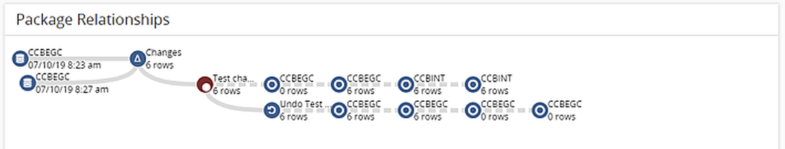

# Use a package
Trellis allows you to create change packages quickly, But what do you do with them afterward?

## Target Environments
If you have package or snapshot, you can test it against other environments to determine if the other environment shares the changes with the selected package. You can then "Migrate" these changes to the specified database.

First open the package by either creating or opening a [comparison](Comparing-Snapshots.md) or [change package](Creating-Change-Packages)

#### Select Target
Find the database you want to tests against in the Targeted Change Packages section and click `Target`

Trellis will go out and check if every change in the open package is contained in the selected target. The date of the test is displayed next to the Target button. The "Tables" and "Rows" columns show the number of tables or rows that are in the open package, that are not also in the target database.

If we take a look at the Package Relationship section we wil notice in addition to the relationship created when we made a [change package](Creating-Change-Packages), there is also an additional dashed line connecting our recently targeted database. Subsequent targeted databases will be appended to this with dotted lines.

### Migrating to a target
While it may be useful to test changes between environments, Targets are much more powerful. If you select `Target` on a specific database and there are changes, a "Play" button will show up. If you click this button and enter the prompted database write authentication, Trellis will write these changes into the target database. This is very useful if you have many of the database in different environments that need these changes applied. 

---
# Undo Packages
Saving change packages is useful, but sometimes we need to undo the changes we make. We can save "Undo Packages" that allow us to undo everything we did in a change package. 

To create an undo package all we have to do is open the specified change package or comparison, and select the `Derive Inverse (Undo) Changes` button in the upper righthand corner of the header. This will create a package that does the exact opposite from the selected changes. If you then [target a database](#Target-Environments) and apply the changes, all the changes outlined in the currently open change package will be undone.