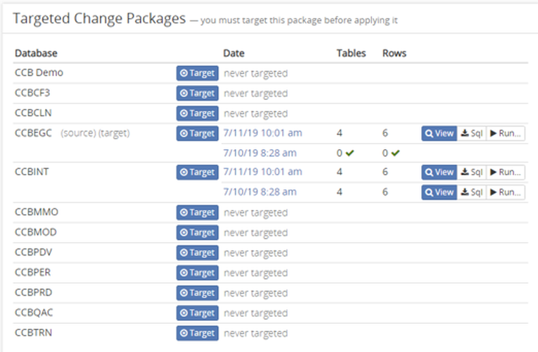

# Use a package 
Trellis allows you to create change packages quickly, But what do you do with them afterward?

## Target Environments
If you have package or snapshot, you can test it against other environments to determine if the other environment shares the changes with the selected package. You can then "Migrate" these changes to the specified database.

First open the package by either creating or opening a [comparison](Snapshot-Comparisons.md) or [change package](Change-Packages)

#### Select Target
Find the database you want to tests against in the Targeted Change Packages section and click `Target`. Trellis will go out and check if every change in the open package is contained in the selected target. The date of the test is displayed next to the Target button. The "Tables" and "Rows" columns show the number of tables or rows that are in the open package, that are not also in the target database.

If we take a look at the Package Relationship section we wil notice in addition to the initial snapshot relationship, there is also an additional dashed line connecting our recently targeted database. Subsequent targeted databases will be appended to this with dotted lines. By targeting multiple different databases we can apply changes to many databases very quickly. 

### Migrating to a target
While targets can be used to test changes between environments, usually that job is left to a comparisons and change packages. You can use targets to apply the changes into the selected database. If you select `Target` on a specific database and there are changes, a `Run` button will appear. If you click this button and enter the prompted proper write credentials for the database, Trellis will write these changes into the target database. This is very useful if you have many of the database in different environments that need these changes applied. 

# Undo Packages
Saving change packages is useful, but sometimes we need to undo the changes we make. We can save "Undo Packages" that allow us to undo everything we did in a change package. 

To create an undo package all we have to do is open the specified change package or comparison, and select the `Derive Inverse (Undo) Changes` button in the upper right hand corner of the header. This will create a package that does the exact opposite from the selected changes. If you then [target a database](#Target-Environments) and apply the changes, all the changes outlined in the currently open change package will be undone. For example, if we selected the CCBINT database from the package relationships section in the ["select target"](#Select-Target) example above and created an undo package, by apply those changes we effectivly undo any of the changes first applied when we targeted CCBINT from the change package that we were working with.

# Downloading a Snapshot
Trellis allows you to download snapshots and packages. You can access the download menu from the header on any of the pages. When you open it you will be shown a list of databases, snapshots, and tables. you can download these as a TODO file.

