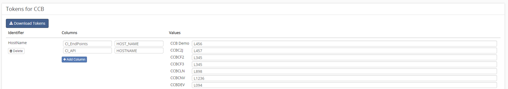

# Using Tokens
Tokens are used to manage environment-specific data within databases. The values saved in tokens will not show up as changes when performing a comparison or creating a change package. Why use them? Sometimes database table hold data that are specific to the environment they are ran in. For example, a hostname or IP address are values that are commonly found in databases. But if you have an environment for Windows, and another for Linux and they are identical other than these values, It makes it difficult to keep updated with one another without having to manage the specific data being updated.

# Adding Tokens
To add tokens, click the `Manage Tokens` button in the tools section in the application home screen. You will be brought to the token management screen. Here you can select an identifier used to name your token, something like "HostName". Then select the columns you expect to see that value in. Then select the name of the value for that specific column. Lastly in the values list insert the value you want placed into your HostName token during migrations or downloads. You can also [download tokenized sql](Download-Tokenized-Sql.md).

