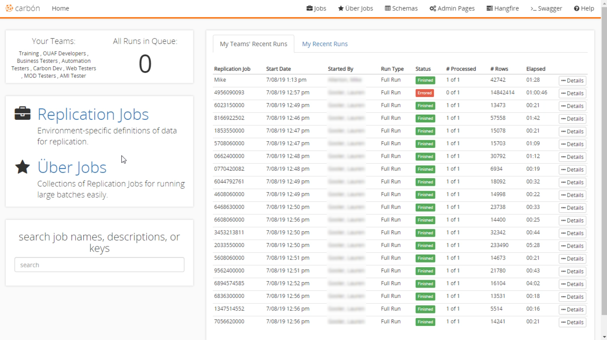

 
# Application Home Overview 
The 'Application Home' screen is divided into several main sections: Header, Teams, Jobs, Search, and Recent Runs. 

 
 
## Header 
The 'Header' is used to show the current screen you are on and to access some of the features and options in Carbon. You can navigate to your jobs, [Uber Jobs](Uber-Jobs.md), [Schema Explorer](Schema-Explorer.md), [Admin Pages](Admin-Pages.md), and [Hangfire](Admin-Pages.md#hangfire). There is also a Swagger generated webpage showing the complete API of Carbon with additional documentation.  
 
## Teams 
'Teams' are used to segregate the accounts within the application. You cannot see accounts in a team if you are not part of that team.  
The number of runs in the queue is displayed in this section. It provides an easy way to see how many jobs need to be completed before a new one can start. 
 
## Jobs 
The 'Jobs' section allows you to navigate to [Replication Job](Replication-Jobs.md) or [Uber Jobs](Uber-Jobs.md).
 
## Search 
In the lower left-hand corner of the screen, the 'Search' section allows you to search for accounts using account numbers, job names, descriptions, keys, etc. It's an easy way to find a specific account and access it quickly. 
 
## Recent Runs 
'Recent Runs' make up the right-hand side of the screen. This section displays all the recent runs your team has made. There is another tab that will display the runs made by you. Both tabs display an item's date of replication, job id, elapsed time, and number of accounts processed. If you select the details button on a row, it shows information about the [Replication Job](Replication-Jobs.md).  

