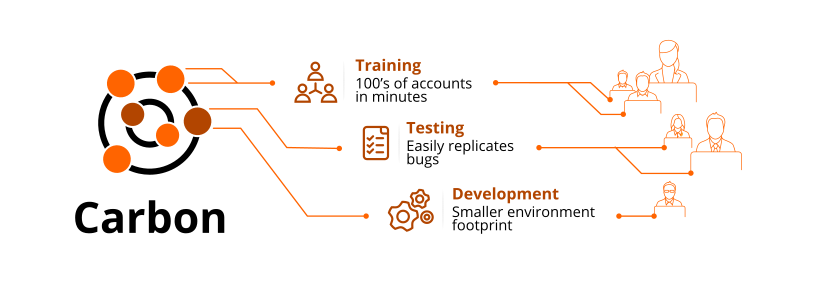

 
  
 
---

## Introduction 
Carbon is used to replicate CCB and MDM accounts or convert from one to the other. It makes it easy to copy or create accounts in groups up to 100, making it easy to set up training and testing environments. You can replicate accounts to create completely new accounts including a unique account number, premise, new keys, etc. Or you can replicate accounts to create identical copies of the account with identical data. 
 
## Getting Started 
This documentation provides information on Carbon by IntelliTect.  
### Options and Configuration 
* Get familiarized with the [Application Home Screen](Application-Home.md) 
* Set up your application with [Admin Pages](Admin-Pages.md) 
* Explore the database with [Schema Explorer](Schema-Explorer.md) 
 
 
### Replicating accounts 
* Copy single accounts with [Replication Jobs](Replication-Jobs.md) 
* Copy many accounts with [Uber Jobs](Uber-Jobs.md) 

