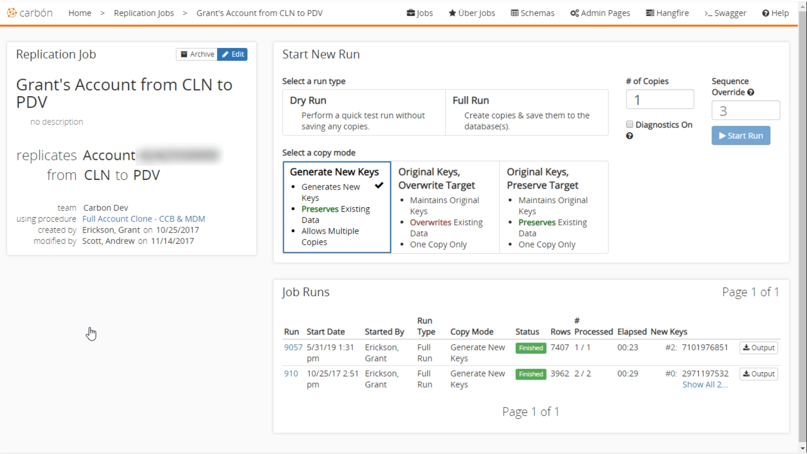
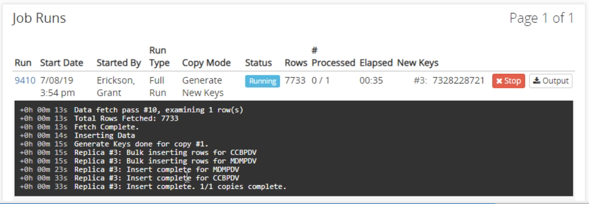

 
# Replication Jobs 
'Replication Jobs' are the core of Carbon. These jobs perform all the account information fetching and creating of replicated accounts. There are multiple ways to create new replication jobs, but they all come down to finding an existing CCB or MDM account you want to replicate. Replication jobs are handy for creating one or two replicated accounts. To replicate more, see [Uber Jobs](Uber-Jobs.md). 
 
## Creating a Replication Job 
To start configuring a replication job, you must select an account. The easiest way to find an account is to use the [search](Application-Home.md#search) feature from the home screen. 
After you have selected an account to replicate, you should see the 'Start New Run' screen. 

 
 
--- 
### Replication Job 
The 'Replication Job' section is located in the upper left-hand corner of this page. It displays details about this account. You can click the `edit` button to change things like the team, source environment, target environment, and starting key. You can archive the selected account to hide it from the interface. An account cannot be permanently deleted because there may be other accounts that were cloned from it. 
 
--- 
### Start New Run 
The 'Start New Run' section is used to configure how Carbon is going to perform the replication of the account. 
 
#### Run Types 
There are two run types to select from.   
A **dry run** will perform all the steps of the replication without actually committing the clones into the target database. It is typically used to ensure the job will succeed and is rarely used. A dry run can also be useful for some testing scenarios. 
 A **full run** will fetch all the associated records for the selected account and then create the cloned account. This clone will be fully committed to the target database. 
 
#### Copy Mode 
Three copy modes determine how Carbon copies the account. Select the copy mode that works best for the scenario you would like. 
 
* Generate New Keys 
  * This is generally the safest form of copying. All keys are generated, and the source account data is copied without any relationship to the existing account. This is the only copy mode supporting more than one copy at a time because its keys are unique. 
* Original Keys, Overwrite Target 
  * This will keep the original keys and data identical to the source. It's useful for transferring data to an environment that does not already contain existing data or to override existing data like pulling a production account into a development environment. Because it is an exact copy of the original, there can only be one in the target database. 
* Original Keys, Preserve Target 
  * This will keep the original keys but will not overwrite the target data. If any rows are in the source database, but not the target, they will be copied. Similar to the overwrite target copy mode, there cannot be more than one copy at a time. 
 
After all the options are set, click the `Start Run` button to start the job.  
 
--- 
### Job Runs 
All previously ran jobs will appear in this section. They include information about the job like the number of rows copied and the number of accounts affected. While a job is running, it will show real-time details about the process, including the various number of rows fetched and rows being inserted into the target. You can also stop a job while it is running. 
 
 
 
After the run is complete, its details will be added to the list. There is an option to roll back recently completed jobs which will undo any of the actions performed by the job. Here, you can also get an output of the job detailing the statistics of the account and anything attached to the account. 

