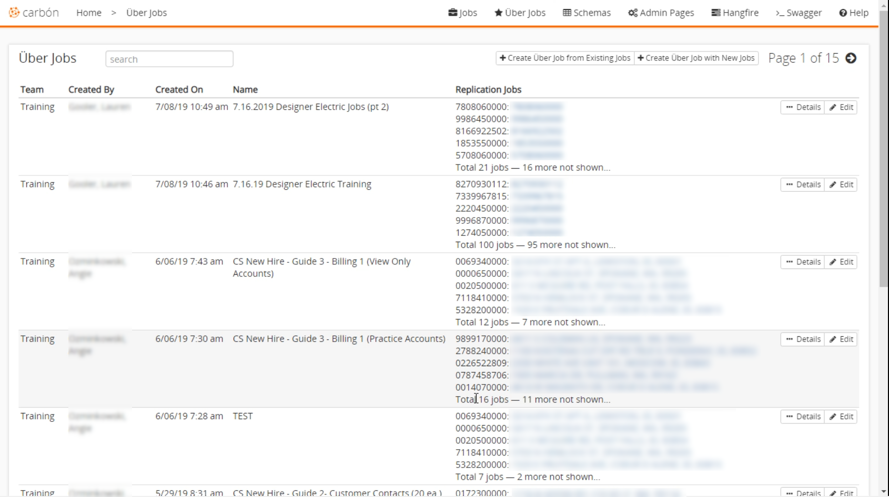
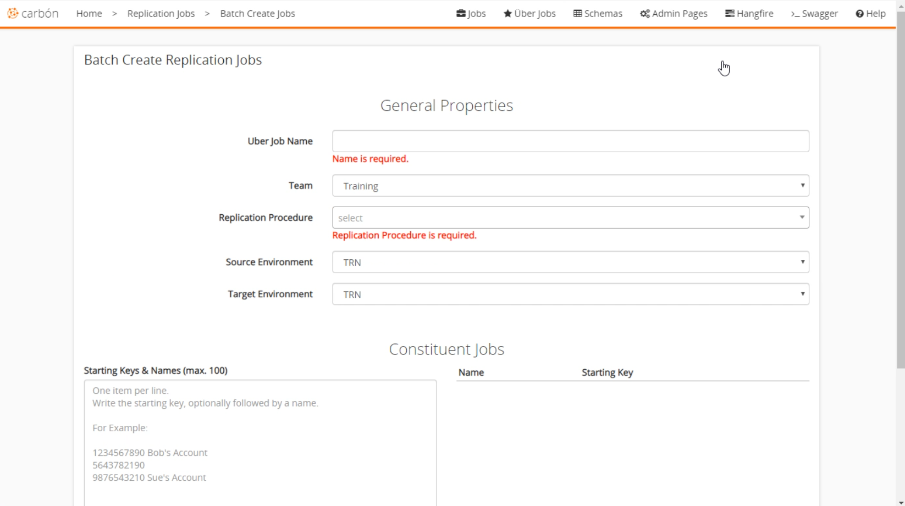
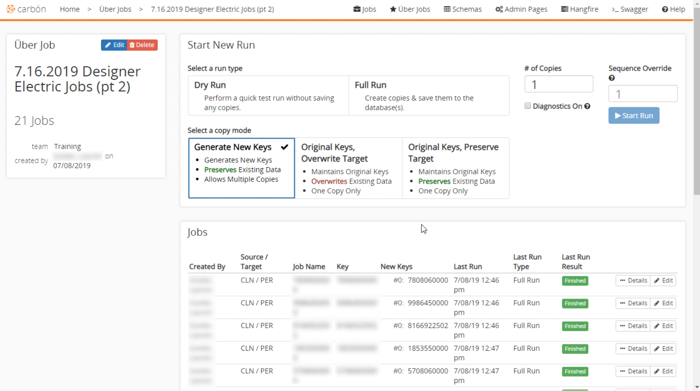

 
# Uber jobs 
Uber jobs are similar to [replication jobs](Replication-Jobs.md) but allow the user to make up to 100 copies at the same time. This is extremely useful for copying accounts over to another environment or setting up training environments where multiple accounts are duplicated from a single account. This allows trainers to provide the same scenario too many people. You can access the [Uber Jobs](Application-Home.md) page in the jobs section. The list displayed here shows all the 'Uber Jobs' for your teams. It shows the author, name, date, and five of the replication jobs performed. You can also select the details or edit the individual Uber Jobs.  

 
 
 
## Creating New Jobs 
There are two ways to create a new 'Uber Job' in Carbon. From the 'Uber Jobs' screen, there are two buttons above the jobs list. You can either create a new job from existing jobs or create uber jobs with new jobs. Generally, we want to create with new jobs.  
 
### General Settings 
After selecting to create with new jobs we enter basic settings like name, team, replication procedure (which is almost always CCB & MDM) and the environments. The source environment is the database that contains the account you want to copy. Target is the database that the replicated accounts are inserted into. 
The 'Starting Keys' section is used to enter the source account numbers and the name you want for the replication job. For example "1234567890 Test Account" will copy the account with that number from the source database and insert it into the target database. After you have the settings configured the way you want, click the `Save Jobs` button. 

 
 
### Starting the job 
After you have saved the settings, you will be navigated to the start job screen. You can also select details for the 'Uber Job' from the jobs list in the main Uber Jobs section.  
 
Here you will be presented with the 'Start New Job' screen. At the top left, you can see the name and the number of jobs in this uber job. The main section is where you select the run type, copy mode, and the number of copies for each account. For more information on the details in this section see [replication jobs](Replication-Jobs.md#start-new-run). When you select `Start Run`, the 'Jobs' section will display real-time information on the jobs currently running. It's likely that replicating many jobs will take some time to complete. 

 

