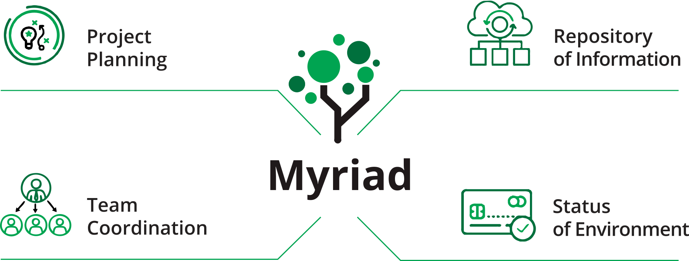

 
 
______ 
## Introduction 
Myriad is a project coordination and information dissemination tool that combines the best of Microsoft Excel, SharePoint, Microsoft Project, and Slack. The program ensures every team member has access to up-to-date information about all applications and environments, including their 
statuses, schedules and real-time collaboration efforts. Myriad is used every day by developers, testers, trainers, operations personnel, business users, IT management and corporate management. 
 
This documentation provides information on Myriad by IntelliTect. 
 
## Getting Started 
* Get familiarized with the [Status Overview](Status-Overview.md) 
* Viewing [Environments](Environments.md) 
* How to use [Applications](Applications.md) 
* About [Event Details](events.md) 
* [Chat](Chat.md) with the team 
* Configure your [User Preferences](Preferences.md) 
 
 
## Administrator Tools and Options 
* View events and phases with the [Timeline](Timeline.md) 
* [Event Planning](Events.md#event-planning-and-tasks)  
* View applications by environment and work items [Application Types](Application-Types.md#applications-by-environment) 
* Setup and configure Myriad using the [Admin Pages](Admin-Pages.md) 
* Connect other applications using [Event APIs](Event-APIs.md) 
* Link and assign TFS/Azure [Work Items](Events.md#work-items) 

