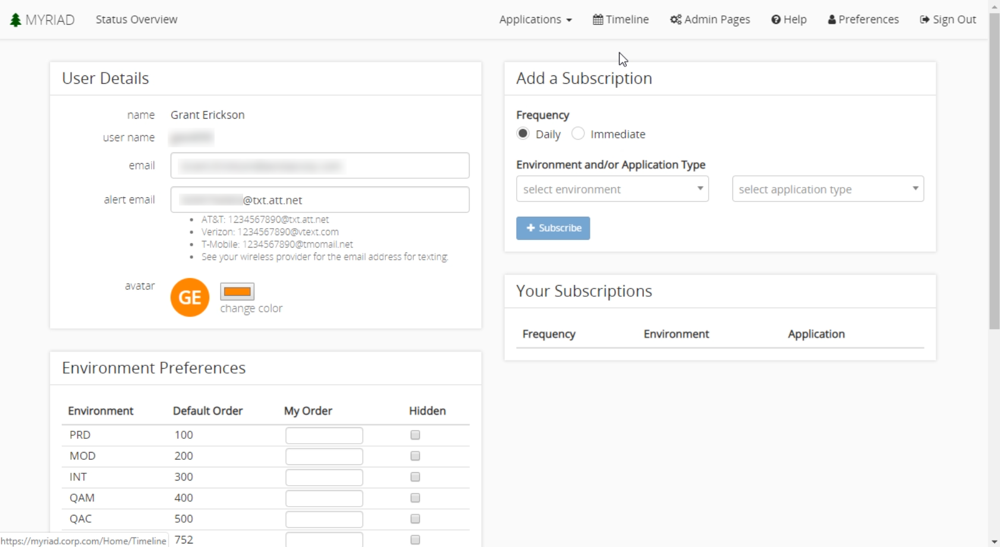

 
# Preferences 
Myriad allows customization of preferences to meet your needs. To navigate to preferences, click the `Preferences` button on the toolbar.  
 
The 'User Details' pane in the upper left shows your name, username, and you can change your email address and notification email address.  
 
The notification email is only used when there are notifications sent out manually or automatically about event details or statuses. You can configure the notifications to be sent as texts to your phone if your mobile carrier supports sending a text through email.  
 
The color of your avatar can also be changed here. Your avatar is used within the event planning section when you create tasks or are assigned to one.  
 
--- 
## Environment Preferences 
When you view the [Status Overview Page](Status-Overview.md) the environments are listed in a particular order. Initially, it uses default order, but you can change that here. The lower the order number the higher in the list it will appear. It is useful to space out your manual orders to allow for easier changes in the future. I.E: if you have the orders 1,2,3 and you want to put something first, you now have to increment every environment. Whereas ordering with 100,200,300 you know can simply make the one you want to first appear 50. In this section, you can also choose to hide environments you don't want to be displayed.   
 
--- 
## Subscriptions 
There are several types of subscriptions you can subscribe to. **Daily subscriptions** are essentially "roll-ups" of a particular environment each morning.  
**Immediate subscriptions** will notify you immediately whenever there are any status changes, or events are started, skipped, etc. You will still receive a daily roll-up with this subscription. 
 
For the item you want notifications from you can select: 
* Any applications in a specific environment 
* A specific application in any environment 
* A specific application in a specific environment  

 

