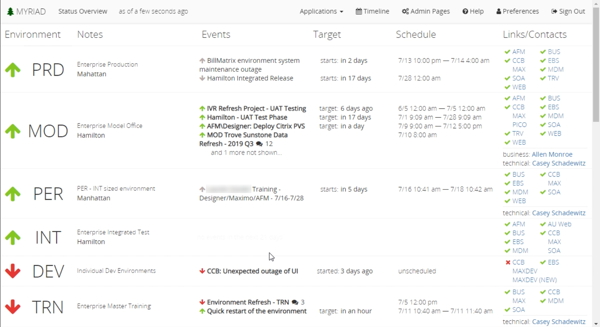
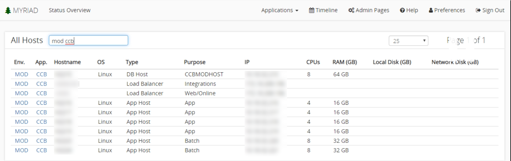

 
# Status Overview 
This page provides a status overview of your [applications](Applications.md). Each [environment](Environments.md) is displayed in the list and contains high-level information like its schedule, applications, environment status, individual events, and event status. 
 
 
 
--- 
## Title Bar 
The title bar displays the page you are currently working on as well as how long ago it was updated. This section also contains some navigation options to  
[admin pages](Admin-Pages.md), [timeline](Timeline.md), [preferences](Preferences.md), [search](#Searching), [application types](Application-Types.md), help, and the sign out button. 
 
--- 
## Environment List 
The entire rest of the screen is made up of a list of environments you have configured in Myriad. For each environment, you can view the name, status, notes(may include the type of production and location). The events column displays events that are either ongoing or are upcoming. The target and schedule columns display when the event is going to take place. The links/contacts column provides a convenient location for links to individual tables and their status. 
 
--- 
### Status 
The status displayed represents the overall status of an environment, application or event.  
* Green up arrow means the environment is working properly 
* Yellow sideways arrow means the environment is up, but there is something compromised. 
* Red down arrow means the environment is completely down. 
 
The status is always determined from the highest impact dependant. For example, if an environment has two applications, one application has a low impact and the other has a high impact. If the high impact application fails, the environment's status will be affected more than if the low impact application goes down. If some dependent statuses are down, and some are working, it results in a partially compromised environment status.  
 
--- 
### Searching Hosts and Applications 
There is a lightweight searching tool that allows you to search for any hosts and applications within Myriad. To open the search screen, click the `Applications` drop down on the title bar, then select `Host & Application Search`. This will bring you to a searching screen. You can type in environments, applications, and hosts. If you wanted to see all the assets in the environment 'MOD' just type "mod". To see all the assets in the application 'CCB' only in the 'MOD' environment type "mod ccb". 
 
 

