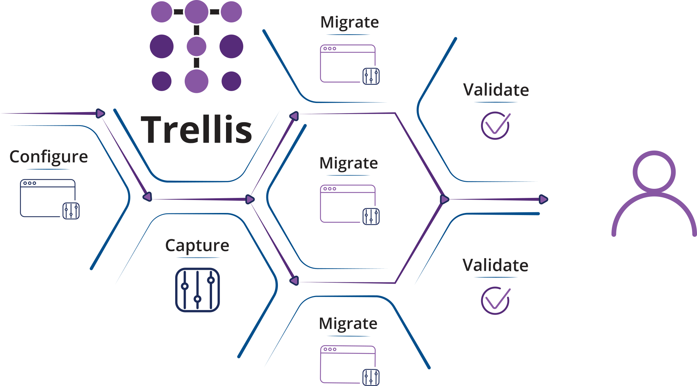

 
 
 
# Introduction 
 
Trellis is a web-based configuration tool designed for large enterprise applications. It allows users to track and invoke changes within and between 
environments in an efficient manner while limiting human errors, all at the click of a button. Additionally, snapshots of the configuration data are periodically recorded and users can be alerted if changes are made. Trellis is a valuable addition to any team using CCB or MDM. 
 
Trellis simplifies the process of managing OUAF configuration by: 
 
* Automating configuration migration across environments through a simple, web-based user interface. 
* Identifying configuration differences between environments over time. 
* Auditing changes to the configurations and alerting the user with details about the changes. 
* Tracking configuration changes to each environment by user and providing a robust “undo” capability 
 
## Getting Started 
 
### Options and Configuration 
 
There are tons of customizable options to test out that will allow Trellis to work well with any project. 
 
* [Application Home Screen](Application-Home.md) 
* [Create a Database](Admin-Pages.md#setting-up-a-database) 
* [Schedule Recurring Snapshots](Admin-Pages.md#recurring-snapshots) 
* [Configure Snapshot-Enabled Tables](Admin-Pages.md#schema-table-selector) 
* [Setup Email Subscriptions](Preferences.md) 
 
### Compare 
 
Trellis makes it a breeze to compare configuration snapshots between different environments. 
 
* [Create Snapshot Comparison](Snapshot-Comparisons.md) 
* [Create Change Package](Change-Packages.md) 
* [Export as Excel File](Download-as-Excel.md) 
* [Export to SQL](Download-Tokenized-Sql.md) 
 
### Migrate 
 
With Trellis, migrating changes is simple. It’s easy to create change packages that you can then migrate to any environment at any time. Trellis automatically creates a customizable package that will apply these changes, or a subset, to other selected environments. 
 
* [Use tokens for environment-specific data](Use-Tokens.md) 
* [Apply changed packages](Use-A-Package.md#migrating-to-a-target) 
* [Rollback change packages](Use-A-Package.md#undo-packages) 

