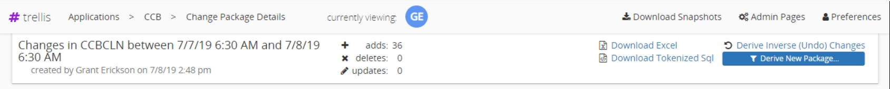
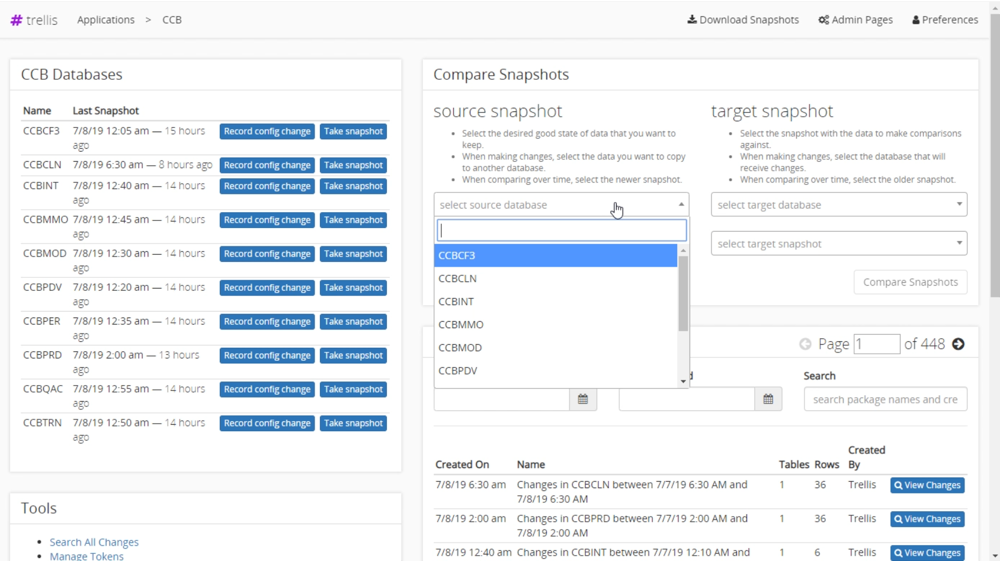
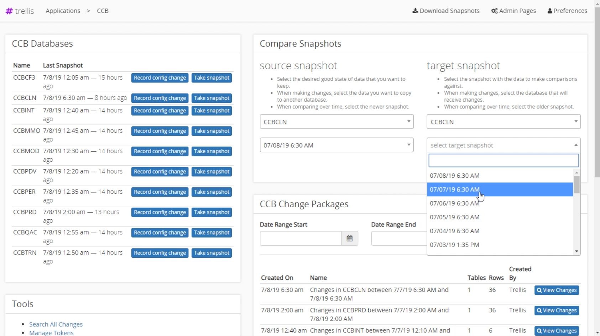
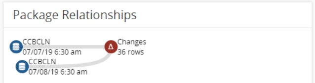
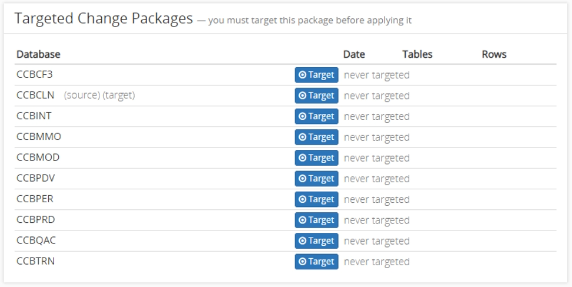
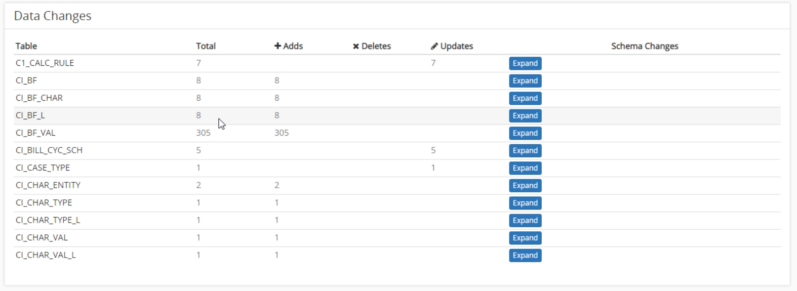
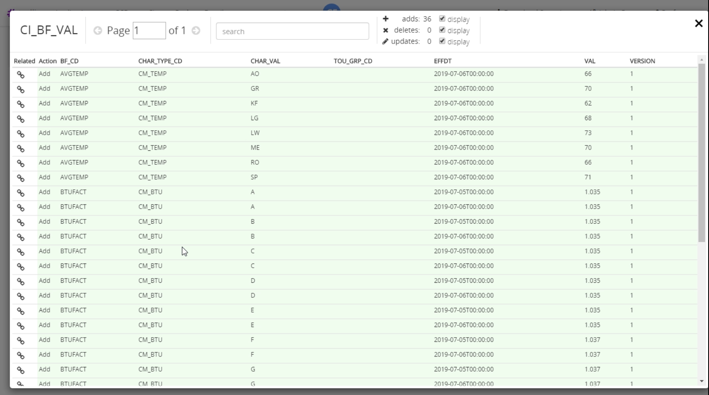

 
# Snapshot Comparisons 
 
Trellis allows you to view the difference between two snapshots, or the difference between the same snapshot at two different points in time. 
 
## Brief Overview 
 
* Open an application containing snapshots you want to compare 
* Select the source database and the timestamp of when the snapshot was taken 
* Select the target database and the timestamp of when the snapshot was taken 
* Click the `Compare Snapshots` button 
* The resulting screen will display all the changes between the target and source snapshots 
 
### Header 
 
The header is displayed at the top of the screen and contains information about the comparison including snapshots compared, time ranges for the comparison, and the number of rows changed. You can also download to [Excel](Download-as-Excel.md) or [Tokenized Sql](Download-Tokenized-Sql.md) from here. 
 
 
 
## Selecting the Snapshots 
 
Start by opening the application you want to perform a comparison in. 
Select the source and target databases you want to compare, then select the particular snapshots. 
 
| Source Snapshot | Target Snapshot | 
| --- | --- | 
|  |  |  
| The source snapshot is the state of data you want to keep. This the newer snapshot of the two. | The target snapshot is the state of data you want to compare against. | 
 
--- 
 
## Viewing Changes 
 
After the package changes are found, the screen will update showing the changes. This screen is broken up into several main sections described below. 
 
--- 
 
### Header 
 
The header is displayed at the top of the screen and contains information about the comparison including the snapshots compared, the time ranges for the comparison, and the number of rows changed. You can also download to [Excel](Download-as-Excel.md) or [Tokenized Sql](Download-Tokenized-Sql.md) from here. 
 
 
 
--- 
 
### Package Relationships 
 
The package relationships section displays the two snapshots being compared. The top snapshot is the target snapshot, and the lower snapshot is the source snapshot. The delta displayed represents all changes of any type. 
 
 
 
--- 
 
### Targeted Change Packages 
 
The targeted change packages section is used to move the changes to another environment. See [Use a Package](Use-A-Package.md#target-environments) for more information on migrating data. 
 
 
 
--- 
 
### Data Changes 
 
This section displays the total number of changes for each table changed between the snapshots. Click the `expand` button to view detailed changes for the specified table. 
 
 
 
--- 
 
### View Detailed Changes 
 
The detailed changes section displays each row that was changed in the selected table. There are three ways the data is displayed 
 
* Added rows are highlighted in green. 
* Deleted rows are highlighted in red. 
* Updated rows show the updated column value highlighted in both red and green corresponding to the previous and updated data. 
 
You can show or hide by change type. I.E: added, deleted, updated. You can also search for the changes to find specific changes in the table. 
 
 

